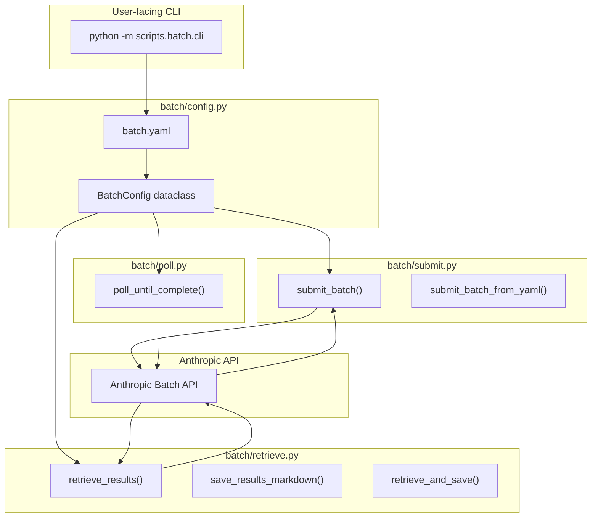

# IDEA-009: Generic Anthropic Batch API Toolkit

**Status:** [IDEA]
**Date:** 2026-03-29
**Author:** Architect (Roo Code)
**Category:** Infrastructure / Developer Tooling
**Affected Documents:** `src/calypso/check_batch_status.py`, `scripts/`, `template/`

---

## 1. Motivation

We ran 3 batches (14 requests total) through the Anthropic Batch API to perform a full coherence audit. The process worked, but required **several fixing cycles** before we could:

1. Submit successfully (API key was hardcoded initially)
2. Retrieve and parse results properly (JSON parsing, error handling)

The lessons learned from these cycles are valuable and should be captured as **reusable, generic infrastructure** so future batch work doesn't repeat the debugging.

### Problems observed during the batch audit:

| # | Problem | Impact |
|---|---------|--------|
| 1 | API key had to be manually set per-session | Friction for every new batch run |
| 2 | No reusable submit/retrieve abstraction | Copy-paste duplication in every batch script |
| 3 | Each retrieve script repeated the same result-parsing logic | Maintenance nightmare |
| 4 | No `--poll` flag in coherence batch scripts | Had to manually re-run retrieve scripts |
| 5 | No `--batch-id` override on retrieve scripts | Had to edit file paths to re-check |
| 6 | No standardized batch config format | Each batch had hardcoded paths/custom_ids |
| 7 | Error handling was inconsistent across scripts | Some errored silently, some printed to stderr |
| 8 | No JSON schema validation on structured outputs | Had to manually fix JSON parse failures |

---

## 2. Proposed Solution

Create a **generic Anthropic Batch API toolkit** that abstracts all common patterns:

```
scripts/
├── batch/
│   ├── __init__.py
│   ├── config.py          # BatchConfig dataclass + YAML loader
│   ├── submit.py          # Submit logic (reusable via import)
│   ├── retrieve.py        # Retrieve + parse logic
│   ├── poll.py            # Polling loop utility
│   └── templates/
│       ├── submit_template.py.j2    # Template for new submit scripts
│       └── retrieve_template.py.j2   # Template for new retrieve scripts

template/scripts/           # Also bundled in template/ for new projects
└── batch/
    ├── __init__.py
    ├── config.py
    ├── submit.py
    ├── retrieve.py
    └── poll.py
```

### 2.1 Batch Configuration Format (YAML)

Each batch job gets a `batch.yaml` config file:

```yaml
# batch.yaml — Governance Coherence Audit
name: "Governance Coherence Audit"
description: "Audit SP-002/.clinerules, SP-003..006/.roomodes, README registry"
model: "claude-sonnet-4-6"
max_tokens: 4096
temperature: 0.3
output_dir: "plans/batch-full-audit/RESULTS"

requests:
  - custom_id: "gov-sp-clinerules"
    system_file: "prompts/SP-002-clinerules-global.md"
    user_template: "templates/system-prompt.txt.j2"
    context_files:
      - ".clinerules"
      - "template/.clinerules"

  - custom_id: "gov-sp-roomodes"
    system_file: "prompts/SP-004-persona-scrum-master.md"
    context_files:
      - ".roomodes"
      - "template/.roomodes"
```

### 2.2 Core Python Modules

#### `batch/config.py` — Configuration

```python
@dataclass
class RequestSpec:
    custom_id: str
    system: str
    user_message: str

@dataclass
class BatchConfig:
    name: str
    description: str
    model: str
    max_tokens: int
    temperature: float
    output_dir: Path
    requests: list[RequestSpec]
    batch_id_file: Path = None  # auto-derived from name

    @classmethod
    def from_yaml(cls, path: Path) -> "BatchConfig":
        """Load batch config from YAML file."""
    
    def save_batch_id(self, batch_id: str):
        """Persist batch_id to file."""
    
    def load_batch_id(self) -> str | None:
        """Load batch_id from file if exists."""
```

#### `batch/submit.py` — Submission

```python
def submit_batch(config: BatchConfig, api_key: str) -> Batch:
    """
    Submit a batch from config.
    Validates ANTHROPIC_API_KEY.
    Returns the Batch object.
    Saves batch_id to config.batch_id_file.
    """

def submit_batch_from_yaml(yaml_path: str | Path, api_key: str | None = None) -> Batch:
    """
    Convenience: load YAML + submit in one call.
    API key defaults to ANTHROPIC_API_KEY env var.
    """
```

#### `batch/retrieve.py` — Retrieval + Parsing

```python
@dataclass
class RequestResult:
    custom_id: str
    status: Literal["succeeded", "errored", "unexpected"]
    text: str | None = None
    error: str | None = None
    input_tokens: int = 0
    output_tokens: int = 0

def retrieve_results(config: BatchConfig, api_key: str) -> list[RequestResult]:
    """
    Retrieve results for a batch.
    Returns structured Result objects.
    """

def save_results_markdown(results: list[RequestResult], output_path: Path, title: str):
    """
    Save results as a Markdown report.
    """

def retrieve_and_save(config: BatchConfig, api_key: str) -> list[RequestResult]:
    """
    Convenience: retrieve + save markdown report in one call.
    """
```

#### `batch/poll.py` — Polling Utility

```python
def poll_until_complete(
    config: BatchConfig,
    api_key: str,
    interval_seconds: int = 60,
    on_status: Callable[[str], None] = None,
) -> list[RequestResult]:
    """
    Poll batch status every `interval_seconds` until 'ended'.
    Calls on_status(status) on each poll.
    Returns results when complete.
    """
```

### 2.3 CLI Entrypoints

```bash
# Submit a batch from YAML config
python -m scripts.batch.cli submit batch.yaml

# Retrieve results (polling until complete)
python -m scripts.batch.cli retrieve batch.yaml --poll

# Quick status check
python -m scripts.batch.cli status batch.yaml

# Override batch ID (for re-checking old batches)
python -m scripts.batch.cli retrieve batch.yaml --batch-id msgbatch_xxxxx
```

### 2.4 Script Templates

Jinja2 templates for generating new batch scripts:

```bash
# Generate a new batch submit+retrieve script pair
python scripts/batch/generate.py \
    --name coherence-audit \
    --requests 4 \
    --output scripts/coherence_audit/
```

---

## 3. Architecture



---

## 4. Lessons Learned from Coherence Audit

These specific issues from the batch audit must be handled by the toolkit:

| # | Lesson | Implementation |
|---|--------|----------------|
| 1 | JSON responses may be wrapped in markdown fences | `retrieve.py` must strip ` ```json ... ``` ` |
| 2 | Some responses aren't valid JSON at all | Fall back to raw text, save as `_raw.txt` |
| 3 | `result.result.type` can be `"error"` not `"errored"` | Normalize: check both variants |
| 4 | Batch status can be `"in_progress"` or `"ended"` | Handle all Anthropic status values |
| 5 | `batch.request_counts` tells you succeeded/errored | Show these in status output |
| 6 | Batch IDs must persist across sessions | File-based storage is essential |
| 7 | Config files may reference non-existent files | Validate context_files exist before submit |
| 8 | Temperature 0.3 + max_tokens 4096 worked well | Make these defaults in BatchConfig |

---

## 5. GitFlow Integration

Following RULE 10 (GitFlow Enforcement):

| Step | Action |
|------|--------|
| 1 | Branch from `develop` → `feature/IDEA-009-batch-toolkit` |
| 2 | Implement toolkit in `scripts/batch/` |
| 3 | Add templates to `template/scripts/batch/` |
| 4 | Bundle in `template/` for new project deployment |
| 5 | Add IDEA-009 to `docs/ideas/IDEAS-BACKLOG.md` |
| 6 | Merge via PR to `develop` |
| 7 | Document in DOC-4 (Operations Guide) |

---

## 6. Deliverables

| # | File | Description |
|---|------|-------------|
| 1 | `scripts/batch/__init__.py` | Package init |
| 2 | `scripts/batch/config.py` | BatchConfig + YAML loader |
| 3 | `scripts/batch/submit.py` | Submit logic |
| 4 | `scripts/batch/retrieve.py` | Retrieve + parse + save |
| 5 | `scripts/batch/poll.py` | Polling utility |
| 6 | `scripts/batch/cli.py` | CLI entrypoint |
| 7 | `scripts/batch/templates/submit_template.py.j2` | Submit script template |
| 8 | `scripts/batch/templates/retrieve_template.py.j2` | Retrieve script template |
| 9 | `scripts/batch/templates/batch.yaml.j2` | Batch config template |
| 10 | `template/scripts/batch/__init__.py` | Template package (bundled) |
| 11 | `template/scripts/batch/config.py` | Template version |
| 12 | `template/scripts/batch/submit.py` | Template version |
| 13 | `template/scripts/batch/retrieve.py` | Template version |
| 14 | `template/scripts/batch/poll.py` | Template version |
| 15 | `docs/releases/v2.3/` entries | After release |

---

## 7. Backward Compatibility

The existing `src/calypso/check_batch_status.py` should **continue to work unchanged**. It uses a different pattern (Calypso-specific output schema validation, JSON file output per expert).

The new `scripts/batch/` toolkit is a **parallel, generic** implementation that:
- Does NOT require Calypso-specific output formats
- Does NOT validate against `expert_report.json` schema
- Focuses on Markdown report generation for document review tasks

Both can coexist. Calypso batch scripts can be migrated to use the new toolkit in a future IDEA if desired.

---

## 8. Alternatives Considered

### Alternative A: Extend `check_batch_status.py`
**Rejected.** That file is Calypso-specific (schema validation, per-expert JSON output). Making it generic would pollute it with concerns unrelated to Calypso.

### Alternative B: Single monolithic script per batch
**Rejected.** We already have this pattern (submit + retrieve scripts per batch). The problem is they duplicate common logic. A toolkit is cleaner.

### Alternative C: MCP server for batch API
**Deferred.** Could be a future IDEA. For now, Python scripts are sufficient and don't require running an MCP server.

---

## 9. Open Questions

1. **Should the toolkit support streaming callbacks during polling?** (e.g., print dots to show it's alive)
2. **Should we add a `--dry-run` flag to validate config without hitting the API?**
3. **Should we bundle an example `batch.yaml` in the toolkit repo itself?**
4. **Should the toolkit auto-detect `ANTHROPIC_API_KEY` vs require it as parameter?**
