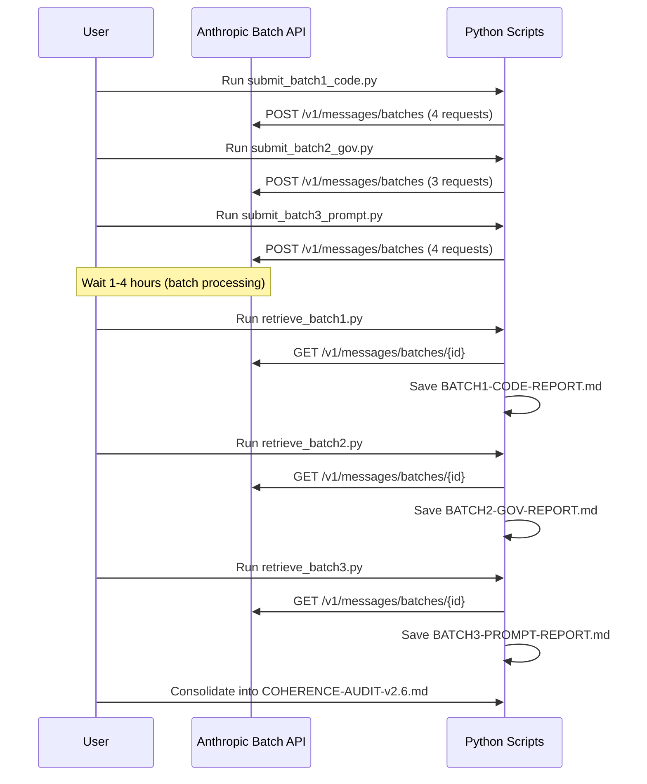

# Audit Plan — v2.6 Coherence Audit

**Document ID:** AUDIT-PLAN-v2.6
**Version:** 1.0
**Status:** Draft
**Date:** 2026-04-01
**QA Engineer:** Roo Code (Code mode, minimax/minimax-m2.7)
**Branch:** develop
**API:** Anthropic Message Batches API (50% cost reduction vs synchronous)
**Model:** `claude-sonnet-4-6`
**Cost target:** <$1.00 total for all batches

---

## 1. Overview

This plan describes a comprehensive coherence audit of the v2.6 release, comparing:
- **Implemented code** vs **DOC-2 (Architecture)**
- **Source rules** (.clinerules) vs **embedded rules** (SP-002)
- **Prompt files** (SP-003..006) vs **deployed .roomodes**
- **Memory Bank** structure vs **DOC-1 (PRD)**

---

## 2. Audit Dimensions

### Dimension 1: Code vs DOC-2 (Implementation vs Architecture)

**Question:** Does the implemented code match what's documented in DOC-2 v2.6?

| Custom ID | Focus | Files Compared |
|---|---|---|
| `code-calypso` | Calypso Phase 2-4 scripts | `src/calypso/orchestrator_phase*.py` ↔ DOC-2 v2.6 §6 |
| `code-sync` | SyncDetector + RefinementWorkflow | `src/calypso/sync_detector.py`, `refinement_workflow.py` ↔ DOC-3 v2.6 |
| `code-heartbeat` | Session heartbeat | `scripts/checkpoint_heartbeat.py` ↔ `.clinerules` MB-4 |
| `code-memory` | Memory Bank structure | `memory-bank/hot-context/*.md` ↔ DOC-1 v2.6 §4 |

### Dimension 2: Governance Coherence (Rules vs Embedded)

**Question:** Are `.clinerules` and `prompts/SP-002` synchronized?

| Custom ID | Focus | Files Compared |
|---|---|---|
| `gov-rules` | Full rules comparison | `.clinerules` ↔ `prompts/SP-002` embedded rules |
| `gov-template` | Template vs root | `template/.clinerules` ↔ `.clinerules` |
| `gov-sp-readme` | Prompt registry | `prompts/README.md` ↔ actual SP files |

### Dimension 3: Prompt vs Deployment (Personas)

**Question:** Are prompt personas identical to deployed .roomodes?

| Custom ID | Focus | Files Compared |
|---|---|---|
| `prompt-productowner` | Product Owner persona | `prompts/SP-003` ↔ `.roomodes` product-owner |
| `prompt-scrummaster` | Scrum Master persona | `prompts/SP-004` ↔ `.roomodes` scrum-master |
| `prompt-developer` | Developer persona | `prompts/SP-005` ↔ `.roomodes` developer |
| `prompt-qaengineer` | QA Engineer persona | `prompts/SP-006` ↔ `.roomodes` qa-engineer |

### Dimension 4: Memory Bank vs DOC-1 (PRD)

**Question:** Does the Memory Bank structure match the PRD?

| Custom ID | Focus | Files Compared |
|---|---|---|
| `memory-hotcold` | Hot/Cold architecture | `memory-bank/hot-context/`, `memory-bank/archive-cold/` ↔ DOC-1 v2.6 §4.2 |
| `memory-files` | Required files present | All 7 hot-context files ↔ DOC-1 v2.6 checklist |
| `memory-progress` | Progress tracking | `memory-bank/progress.md` ↔ DOC-3 v2.6 execution chapter |

---

## 3. Files to Create

```
docs/qa/v2.6/
├── AUDIT-PLAN-v2.6.md              ← This file
├── COHERENCE-AUDIT-v2.6.md         ← (generated) Final report
├── EXECUTION-LOG-v2.6.md          ← (generated) Session log
└── BATCHES/
    ├── batch_id_1_code.txt          ← (generated) Code audit batch ID
    ├── batch_id_2_gov.txt            ← (generated) Governance batch ID
    ├── batch_id_3_prompt.txt         ← (generated) Prompt batch ID
    └── RESULTS/
        ├── BATCH1-CODE-REPORT.md    ← (generated)
        ├── BATCH2-GOV-REPORT.md     ← (generated)
        └── BATCH3-PROMPT-REPORT.md  ← (generated)
```

---

## 4. Execution Workflow



---

## 5. Prerequisites

1. `ANTHROPIC_API_KEY` must be set:
   ```powershell
   $env:ANTHROPIC_API_KEY = "sk-ant-..."
   ```
2. Install the `anthropic` package:
   ```powershell
   pip install anthropic
   ```
3. Run all scripts from the **workspace root**:
   ```
   c:/Users/nghia/AGENTIC_DEVELOPMENT_PROJECTS/agentic-agile-workbench
   ```

---

## 6. Step-by-Step Instructions

### Submit All 3 Batches

```powershell
python docs/qa/v2.6/submit_batch1_code.py
python docs/qa/v2.6/submit_batch2_gov.py
python docs/qa/v2.6/submit_batch3_prompt.py
```

### Wait 1-4 Hours for Processing

### Retrieve Results

```powershell
python docs/qa/v2.6/retrieve_batch1.py
python docs/qa/v2.6/retrieve_batch2.py
python docs/qa/v2.6/retrieve_batch3.py
```

### Consolidate Report

Manually combine results into `COHERENCE-AUDIT-v2.6.md`.

---

## 7. Cost Estimate

| Batch | Requests | Est. Tokens | Batch API Cost |
|---|---|---|---|
| BATCH 1 (Code) | 4 | ~20,000 in + ~16,000 out | ~$0.07 |
| BATCH 2 (Gov) | 3 | ~15,000 in + ~12,000 out | ~$0.05 |
| BATCH 3 (Prompt) | 4 | ~18,000 in + ~16,000 out | ~$0.07 |
| **TOTAL** | **11** | **~53,000 in + ~44,000 out** | **~$0.19** |

At Batch API pricing (50% of standard Sonnet-4-6 pricing).

---

## 8. Model Parameters

| Parameter | Value | Rationale |
|---|---|---|
| `model` | `claude-sonnet-4-6` | Best quality/cost for structured analysis |
| `max_tokens` | `4096` | Sufficient for detailed structured reports |
| `temperature` | `0.3` | Low temperature for consistent analysis |
| `system` | Expert persona prompt | Forces structured output with P0/P1/P2 |

---

## 9. Output Format (Per Request)

Each batch request produces a structured report:

```
## 1. Executive Summary
3-5 bullet points

## 2. Findings
Detailed findings with file:line references

## 3. Inconsistencies Found
| Severity | Location | Description | Expected | Actual |
|---|---|---|---|---|
| P0 | file:line | description | expected | actual |

## 4. Prioritized Remediation
- **P0 (Critical):** Must fix before next release
- **P1 (Important):** Should fix in next sprint
- **P2 (Nice to have):** Fix when convenient

## 5. Verdict
[CONSISTENT] / [MINOR_ISSUES] / [MAJOR_INCONSISTENCIES]
```

---

## 10. Next Steps After Audit

1. **Read** all 3 reports in `docs/qa/v2.6/BATCHES/RESULTS/`
2. **Consolidate** findings into `docs/qa/v2.6/COHERENCE-AUDIT-v2.6.md`
3. **Triage** findings using IDEA capture process (RULE 8.2)
4. **Fix P0 issues** in a dedicated feature branch
5. **Commit** fixes with Conventional Commits
6. **Update** `docs/releases/v2.6/` canonical docs if needed
