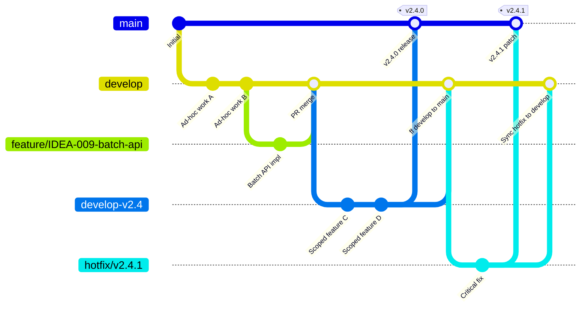

# DOC-4 -- Operations Guide (v2.4)

> **Status: DRAFT** -- This document is in draft for v2.4.0 release. It will be frozen upon QA approval.

---

## Table of Contents

1. [GitFlow Reference](#1-gitflow-reference)
2. [Anthropic Batch API Toolkit Operations](#2-anthropic-batch-api-toolkit-operations)
3. [SP-002 Pre-Commit Hook Operations](#3-sp-002-pre-commit-hook-operations)
4. [Rollback Procedures](#4-rollback-procedures)

---

## 1. GitFlow Reference

> **Source of truth:** This chapter mirrors [RULE 10](.clinerules) in `.clinerules`. Both are kept in sync. RULE 10 is the authoritative runtime rule; this chapter is the human-readable canonical reference.

### 1.1 Branch Definitions

| Branch | Purpose | Lifecycle |
|--------|---------|----------|
| `main` | Production state. **Frozen.** Only receives merge commits from `develop-vX.Y` at release time. Tags mark releases. | Never deleted. Never committed to directly. |
| `develop` | **Wild mainline.** Ad-hoc features, experiments, quick fixes — no formal scope. | Long-lived. Never deleted. Always the base for `develop-vX.Y`. |
| `develop-vX.Y` | **Scoped backlog.** Created when IDEAs are formally triaged for vX.Y. All release-scope work lands here. | Created at release planning. Never deleted after merge — kept for traceability. |
| `feature/{IDEA-NNN}-{slug}` | Single feature or fix. | Branch from `develop` (ad-hoc) or `develop-vX.Y` (scoped), merge back via PR. Never deleted — kept for traceability. |
| `hotfix/vX.Y.Z` | Emergency production fix. | Branched from production tag on `main`. Merged to `main` and `develop`. Never deleted — kept for traceability. |

### 1.2 Forbidden Actions

- **NEVER** commit directly on `main` after a release tag
- **NEVER** commit on a branch that has been merged to `main` (use a new branch instead)
- **NEVER** commit feature work directly on a release or main branch -- use feature branches
- **ALL** new development MUST target `develop`, `develop-vX.Y`, or a feature branch derived from them

### 1.3 Feature Branch Workflow

All new development (features, bug fixes, refactors) follows this path:

```
1. Branch from develop (ad-hoc) or develop-vX.Y (scoped)
   → feature/{IDEA-NNN}-{slug} or fix/{description}
2. Develop and test on the feature branch
3. Commit results to the feature branch
4. Merge via PR to the source branch (fast-forward or squash)
5. Keep the feature branch after merge — never delete it (traceability)
```

> **Exception:** Governance-only commits (ADRs, RULE additions, docs fixes) that do not change application code MAY be committed directly on `develop`.

### 1.4 Release Workflow



**Step-by-step:**

1. **Create** `develop-vX.Y` from `develop` when IDEAs are formally triaged for vX.Y
2. **Land** all vX.Y-scope commits on `develop-vX.Y`
3. **Finalize** — create frozen docs in `docs/releases/vX.Y/`, tag `vX.Y.0` on `develop-vX.Y`
4. **Merge** to `main`
5. **Keep** `develop-vX.Y` after merge — never delete it (traceability)
6. **Fast-forward `develop` to `main`** immediately:
   ```bash
   git checkout develop && git merge --ff main
   ```
   This restores the invariant: `develop` is always at or ahead of `main`, never behind.
7. **Continue** on `develop` for the next release cycle

### 1.5 Hotfix Exception

A hotfix ALWAYS interrupts a planned release.

```mermaid
gitGraph
   commit id: "v2.4.0" tag: "v2.4.0"
   branch hotfix/v2.4.1
   checkout hotfix/v2.4.1
   commit id: "Critical bug fix"
   checkout main
   merge hotfix/v2.4.1 id: "v2.4.1 patch" tag: "v2.4.1"
   checkout develop
   merge hotfix/v2.4.1 id: "Sync hotfix"
```

**Step-by-step:**

1. Branch `hotfix/vX.Y.Z` from the production tag on `main`
2. Fix and test on the hotfix branch
3. Merge to **both** `main` and `develop`
4. Tag `vX.Y.Z` on both branches
5. Keep the hotfix branch after merge — never delete it (traceability)

### 1.6 The Two Development Modes

#### Ad-Hoc Mode (`develop`)

Any feature, any time, no formal scope.

- Feature branches branch from `develop`
- Governance-only commits (ADRs, RULE additions, docs fixes) MAY be committed directly to `develop`
- Use this for: bug fixes, experiments, infrastructure improvements, dev-tooling

#### Scoped Mode (`develop-vX.Y`)

Created when IDEAs are formally triaged for a specific version.

- All vX.Y-scope work lands on `develop-vX.Y`
- Feature branches branch from `develop-vX.Y`
- Use this for: planned features, product releases, coordinated improvements

### 1.7 The vX.Y Version — Three Places

| Place | Long-lived? | Notes |
|-------|-------------|-------|
| Git tag (`v2.4.0`) | No | Lightweight tag on `main`. No development happens on a tag. |
| Frozen docs folder (`docs/releases/v2.4/`) | Yes | Created **after** the tag. **Never edited** after creation (RULE 8). |
| Scoped backlog branch (`develop-v2.4`) | Yes (temporary) | Exists during development cycle. Deleted after merge to `main` — **kept for traceability per v2.4 update**. |

### 1.8 Git Commit Convention

Use **Conventional Commits** (per RULE 5.3):

| Type | Use for |
|------|---------|
| `feat(scope)` | New feature |
| `fix(scope)` | Bug fix |
| `docs(memory)` | Memory Bank update |
| `docs(plans)` | Documentation update |
| `chore(config)` | Configuration change |
| `chore(prompts)` | System prompt modification |
| `refactor(scope)` | Refactoring without functional change |
| `test(scope)` | Adding or modifying tests |

### 1.9 What Is Versioned

**Everything** under Git (per RULE 5.1):

- Application source code (`src/`)
- System scripts (`proxy.py`, `scripts/`)
- Configuration files (`.clinerules`, `.roomodes`, `Modelfile`, `requirements.txt`)
- The Memory Bank (`memory-bank/`)
- System prompts (`prompts/SP-*.md`)
- Plans and architecture documents (`plans/` and `workbench/*.md`)
- QA reports (`docs/qa/`)
- Canonical documentation (`docs/releases/*/` and `docs/DOC-*-CURRENT.md`)
- The workbench template (`template/`)
- Git hooks (`.githooks/`)
- Git attributes and configuration (`.gitattributes`, `.gitignore`)

**Never versioned:** `venv/`, `.env` files, `__pycache__/`, `*.pyc`, `*.log`

### 1.10 ADR Reference

This gitflow is documented as **ADR-006** in `memory-bank/hot-context/decisionLog.md`.

---

## 2. Anthropic Batch API Toolkit Operations

### 2.1 Prerequisites

```bash
# Install dependencies
pip install -r requirements.txt

# Verify installation
python -m scripts.batch.cli --help
```

### 2.2 Creating a batch.yaml

```yaml
name: my-batch
model: claude-sonnet-4-6
max_tokens: 8192
temperature: 0.7
output_dir: ./batch_results
batch_id_file: .batch_id

requests:
  - custom_id: request-001
    method: POST
    url: https://api.anthropic.com/v1/messages
    headers:
      x-api-key: ${ANTHROPIC_API_KEY}
      anthropic-version: 2023-06-01
      content-type: application/json
    body:
      model: claude-sonnet-4-6
      max_tokens: 8192
      temperature: 0.7
      messages:
        - role: user
          content: "Your prompt here"
```

### 2.3 Submitting a Batch

```bash
# Set API key
export ANTHROPIC_API_KEY=sk-ant-...

# Submit
python -m scripts.batch.cli submit batch.yaml

# Output: Batch submitted. batch_id: abc123 saved to .batch_id
```

### 2.4 Polling for Completion

```bash
# Poll until complete
python -m scripts.batch.cli poll batch.yaml

# Output: Batch status: completed. 1/1 results saved to ./batch_results/
```

### 2.5 Retrieving Results

```bash
# Retrieve all results
python -m scripts.batch.cli retrieve batch.yaml

# Output: Retrieved 1/1 results. Full results in ./batch_results/
```

### 2.6 Troubleshooting

| Issue | Solution |
|-------|----------|
| `ANTHROPIC_API_KEY` not set | Export key or pass `--api-key` flag |
| Batch not found | Check `batch_id_file` exists and contains valid ID |
| JSON parse error | Check response has ```json fences; retrieve.py handles this |
| Rate limit | Wait and retry; reduce polling frequency |

---

## 3. SP-002 Pre-Commit Hook Operations

### 3.1 Validation Checks

The pre-commit hook (`scripts/check-prompts-sync.ps1`) validates:

- **BOM detection** — UTF-8 BOM (EF BB BF) at file start → FAIL
- **Mojibake detection** — é, â†', â€", â€" patterns → FAIL
- **Literal \n detection** — \n inside string content → FAIL
- **Full file sync** — `.clinerules` content matches embedded template in `prompts/SP-002-clinerules-global.md`

### 3.2 Running Manually

```powershell
# Run coherence check manually
./scripts/check-prompts-sync.ps1

# Expected output:
# [SP-002] .clinerules (entire file)... PASS
```

### 3.3 If SP-002 Fails

1. Do not bypass the pre-commit hook
2. Investigate encoding: open in binary mode, check for BOM
3. Fix encoding issues in canonical SP-002
4. Re-run `check-prompts-sync.ps1`
5. Commit only when all SPs pass

### 3.4 RULE 6: Prompt Registry Consistency

When modifying files linked to prompts (`proxy.py`, `.roomodes`, `.clinerules`, `Modelfile`):

1. Read `prompts/README.md` to identify the affected prompt
2. Open the corresponding `SP-XXX` file in `prompts/`
3. If the prompt content must change: modify SP-XXX, increment its version
4. If SP-007 (Gem Gemini) is impacted: add a warning in the commit:
   `"MANUAL DEPLOYMENT REQUIRED: update the Gem Gemini with SP-007"`
5. Include the modified `prompts/` files in the same commit as the target files

---

## 4. Rollback Procedures

### 4.1 Rollback a Feature Branch Merge

```bash
# If issues found after merge:
git revert <merge-commit>
git push origin develop

# For develop-vX.Y: re-create from develop if needed
git checkout develop && git branch develop-vX.Y
```

### 4.2 Rollback SP-002 Changes

```bash
# Revert SP-002 to previous version
git checkout HEAD~1 -- prompts/SP-002-clinerules-global.md
git checkout HEAD~1 -- template/prompts/SP-002-clinerules-global.md
git commit -m "revert: SP-002 changes"
# Then rebuild .clinerules from SP-002
```

### 4.3 Hotfix Rollback

```bash
# Revert the hotfix merge
git revert <hotfix-merge-commit>
git tag -d vX.Y.Z        # Delete the patch tag
git push origin :refs/tags/vX.Y.Z
```

---

*End of DOC-4 v2.4 (Draft)*
