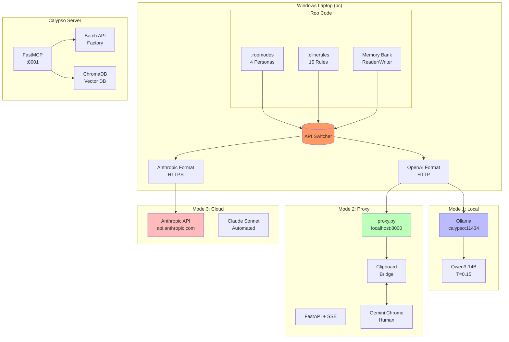
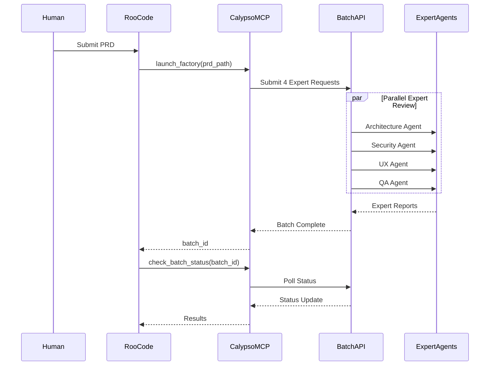
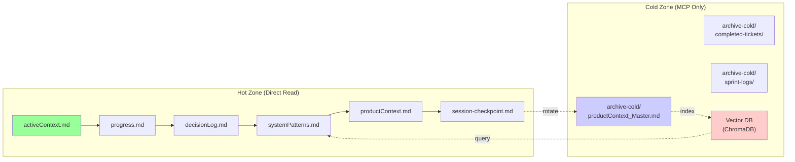
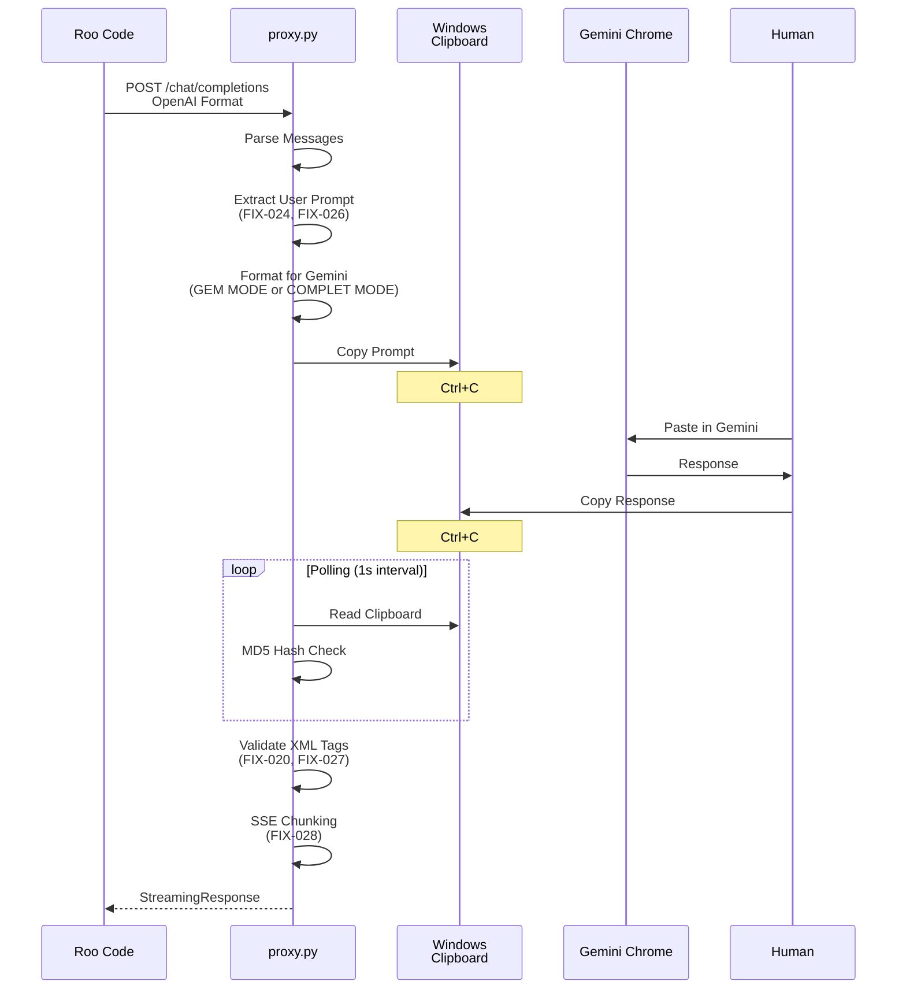
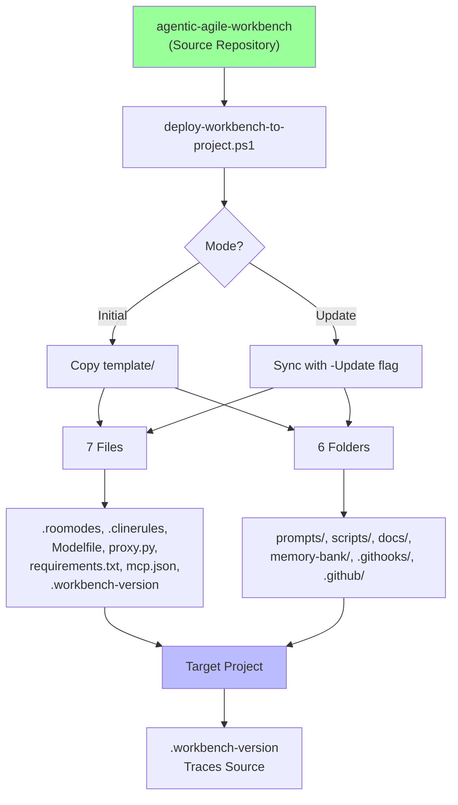

# DOC-2 — Architecture Document (v2.9)

> **Status: DRAFT** -- This document is in draft for v2.9.0 release. It will be frozen upon QA approval.
> **Cumulative: YES** -- This document contains all architecture from v1.0 through v2.9.
> To understand the full project architecture, read this document from top to bottom.
> Do not rely on previous release documents -- they are delta-based and incomplete.

---

## Table of Contents

1. [Guiding Principle](#1-guiding-principle)
2. [Global Architecture Diagram](#2-global-architecture-diagram)
3. [Detailed Technical Stack](#3-detailed-technical-stack)
4. [Architecture Decisions (v1.0)](#4-architecture-decisions-v10)
5. [Functional Layer Architecture](#5-functional-layer-architecture)
6. [Architecture / Feature / Requirement Traceability Matrix](#6-architecture-feature--requirement-traceability-matrix)
7. [v2.1 Architecture Additions](#7-v21-architecture-additions)
8. [v2.3 Architecture Additions](#8-v23-architecture-additions)
9. [v2.4 Architecture Additions](#9-v24-architecture-additions)
10. [v2.5 Architecture Additions](#10-v25-architecture-additions)
11. [v2.6 Architecture Additions](#11-v26-architecture-additions)
12. [v2.7 Architecture Additions](#12-v27-architecture-additions)
13. [v2.8 Architecture Additions](#13-v28-architecture-additions)
14. [v2.9 Architecture Additions](#14-v29-architecture-additions)
15. [Appendices](#15-appendices)

---

## 1. Guiding Principle

**Roo Code is the sole and unique agentic execution engine.** All other components (local LLM engine, clipboard proxy, cloud API, Memory Bank, Agile personas) are **service providers** that interface with Roo Code via standardized protocols.

This principle guarantees that:
- Roo Code's behavior is never modified, regardless of the LLM source used.
- Switching between the three backends (local Ollama, Gemini Chrome Proxy, Anthropic Claude API) is transparent to Roo Code — only the "API Provider" parameter changes.
- The Memory Bank and Agile personas function identically in all three modes.

---

## 2. Global Architecture Diagram

```
+---------------------------------------------------------------------------------------+
| |              WINDOWS LAPTOP "pc" (VS Code + Roo Code + Chrome)                        | |
| |                                                                                       | |
| |  +--------------------------------------------------------------------------+          | |
| |  |                      ROO CODE (VS Code Extension)                         |          | |
| |  |                                                                          |          | |
| |  |  +-------------+  +--------------+  +----------------------------+      |          | |
| |  |  |  .roomodes  |  | .clinerules  |  |   Memory Bank Reader       |      |          | |
| |  |  |  (4 Agile   |  |  (15 Mandatory  |   (Read/Write .md)         |      |          | |
| |  |  |   Personas) |  |   Rules)     |  |                            |      |          | |
| |  |  +-------------+  +--------------+  +----------------------------+      |          | |
| |  |                                                                          |          | |
| |  |    OpenAI-Compatible API (HTTP)         Anthropic API (HTTPS)           |          | |
| |  +------------------+-----------------------+----------------+--------------+          | |
| |                     |                                        |                           | |
| |         +-----------+------------+                           |                           | |
| |         |    LLM SWITCHER        |  (Provider Parameter      |                           | |
| |         |    (3 modes)           |   in Roo Code)             |                           | |
| |         +-----------+------------+                           |                           | |
| |                     |                                        |                           | |
| |       +-------------+-------------+                          |                           | |
| |       |                           |                          |                           | |
| |  +----+----------+   +------------+----------+   +-----------+-----------+               | |
| |  | MODE 1        |   | MODE 2                |   | MODE 3                |               | |
| |  | LOCAL         |   | GEMINI PROXY          |   | DIRECT CLOUD          |               | |
| |  | (Tailscale)   |   |                       |   |                       |               | |
| |  |               |   | proxy.py              |   | Anthropic API         |               | |
| |  | calypso:11434 |   | localhost:8000        |   | api.anthropic.com     |               | |
| |  | (via Tailscale|   | (FastAPI + SSE)       |   | (native HTTPS)        |               | |
| |  |  private net) |   |         |             |   |                       |               | |
| |  | uadf-agent    |   | Windows |             |   | claude-sonnet-4-6     |               | |
| |  | (Qwen3-14B    |   | Clip-   |             |   | (Anthropic Provider   |               | |
| |  |  T=0.15)      |   | board   |             |   |  native Roo Code)     |               | |
| |  |               |   |         |             |   |                       |               | |
| |  | Free          |   | Free    |             |   | Paid per usage        |               | |
| |  | Private net   |   | Copy-   |             |   | Fully automated       |               | |
| |  | Tailscale     |   | paste   |             |   | Connection required   |               | |
| |  +---------------+   +----+----+             +-----------------------+---+               | |
| |                           |                                                       |           | |
| |                  +--------+---------+                                             |           | |
| |                  |  HUMAN           |                                             |           | |
| |                  |  INTERVENTION    |                                             |           | |
| |                  |  (Ctrl+V/Ctrl+C) |                                             |           | |
| |                  +--------+---------+                                             |           | |
| |                           |                                                       |           | |
| +---------------------------+-------------------+------+------------------------------------+ |
|             |  Tailscale VPN    |                   |      | |
|             |  (private network)|                   |      | |
|             +-------------------+                   |      | |
|                                                  |      | |
|   +----------------------------------------------+------+----------------------------------+ |
|   |                           CALYPSO SERVER     |      |                                    | |
|   |                          (headless Linux)    |      |                                    | |
|   |                                                                          |            | |
|   |  +------------+   +------------+   +------------+   +------------+              |            | |
|   |  |  Ollama   |   |  Calypso  |   |  Vector DB |   |  Scripts  |              |            | |
|   |  |  (LLM)    |   |  (MCP)    |   |  (ChromaDB)|   |  (batch/) |              |            | |
|   |  |            |   |           |   |            |   |            |              |            | |
|   |  | uadf-agent |   | :8001     |   |  Memory    |   |  Factory  |              |            | |
|   |  | qwen3-32B  |   | FastMCP   |   |  Bank      |   |  Pipeline |              |            | |
|   |  |            |   |           |   |  Archive   |   |            |              |            | |
|   |  +------------+   +-----------+   +------------+   +------------+              |            | |
|   |                                                                           |            | |
|   +---------------------------------------------------------------------------+-------------+ |
```

### 2.1 Source File Attribution

| Component | Source File | Reference |
|-----------|-------------|-----------|
| Roo Code Extension | VS Code Marketplace | External dependency |
| .roomodes | [`.roomodes`](.roomodes:1) | 4 Agile persona definitions |
| .clinerules | [`.clinerules`](.clinerules:1) | 15 mandatory rules |
| Memory Bank | [`memory-bank/`](memory-bank/hot-context/) | Session persistence |
| proxy.py | [`proxy.py`](proxy.py:1) | v2.8.0 clipboard bridge |
| Calypso MCP | [`src/calypso/fastmcp_server.py`](src/calypso/fastmcp_server.py:1) | 4 orchestration tools |
| Ollama | External | Local LLM inference |
| Anthropic API | External | Cloud LLM fallback |

---

## 3. Detailed Technical Stack

### 3.1 Core Technologies

| Layer | Technology | Version | Source File |
|-------|-----------|---------|-------------|
| **Agentic Engine** | Roo Code | Latest | VS Code Extension |
| **Local LLM** | Ollama + Qwen3 | 14B params | [Modelfile](Modelfile:1) |
| **Clipboard Proxy** | FastAPI + SSE | v2.8.0 | [proxy.py](proxy.py:1) |
| **Cloud LLM** | Anthropic Claude | API v1 | requirements.txt |
| **Orchestration** | Calypso FastMCP | 2.0.0 | [fastmcp_server.py](src/calypso/fastmcp_server.py:1) |
| **Vector Memory** | ChromaDB | >=0.6.0 | requirements.txt |
| **HTTP Server** | Uvicorn | 0.42.0 | requirements.txt |
| **Clipboard** | Pyperclip | 1.11.0 | requirements.txt |

### 3.2 Python Dependencies

From [`requirements.txt`](requirements.txt:1):

```
anthropic>=0.49.0        # Anthropic Claude API client
fastmcp>=2.0.0           # MCP protocol server
chromadb>=0.6.0          # Vector database for memory
fastapi==0.135.2         # Web framework
uvicorn==0.42.0          # ASGI server
pyperclip==1.11.0        # Cross-platform clipboard
pydantic==2.12.5         # Data validation
jinja2>=3.1.0            # Template engine
pyyaml>=6.0              # YAML parsing
```

### 3.3 Infrastructure as Code

| File | Purpose | Source |
|------|---------|--------|
| [`.githooks/pre-commit`](.githooks/pre-commit:1) | Pre-commit SP sync validation | Bash script |
| [`.githooks/pre-receive`](.githooks/pre-receive:1) | GitFlow + cumulative enforcement | Bash script |
| [`.github/workflows/canonical-docs-check.yml`](.github/workflows/canonical-docs-check.yml:1) | CI/CD validation | GitHub Actions |
| [`.gitattributes`](.gitattributes:1) | Line-ending normalization | Git config |
| [`.gitignore`](.gitignore:1) | Version control scope | Git config |

---

## 4. Architecture Decisions (v1.0)

### 4.1 ADR-001: Roo Code as Sole Agentic Engine

**Date:** v1.0  
**Status:** Accepted  
**Context:** The system needed a central agentic execution engine that could switch between multiple LLM backends.

**Decision:** Roo Code (VS Code extension) is the sole agentic execution engine. All LLM backends (Ollama, Gemini Chrome Proxy, Anthropic API) are service providers that implement the OpenAI-compatible API format.

**Consequences:**
- Roo Code behavior is never modified
- Switching backends requires only changing the API Provider parameter
- Memory Bank and personas work identically across all modes

### 4.2 ADR-002: Three-Mode LLM Backend

**Date:** v1.0  
**Status:** Accepted  
**Context:** Cost, privacy, and automation requirements differed across use cases.

**Decision:** Implement three switchable LLM backend modes:
1. **Local Mode** (Ollama) — Free, total data sovereignty, requires Tailscale
2. **Proxy Mode** (Gemini Chrome) — Free, copy-paste human intervention, partial Google data sharing
3. **Cloud Mode** (Claude Sonnet) — Paid, fully automated, partial Anthropic data sharing

### 4.3 ADR-003: Memory Bank as Session Persistence

**Date:** v1.0  
**Status:** Accepted  
**Context:** Agents needed persistent context across sessions without database dependency.

**Decision:** Use Git-versioned Markdown files in `memory-bank/` for all session state. Hot context (active) vs Cold archive (historical) separation.

---

## 5. Functional Layer Architecture

### 5.1 Layer 1: Agentic Execution (Roo Code)

**Source:** [`.roomodes`](.roomodes:1)

Roo Code provides 4 Agile persona modes:

| Persona | Role Definition | Groups |
|---------|-----------------|--------|
| **product-owner** | Defines product backlog, writes user stories | read, memory-bank/productContext.md, docs/*.md |
| **scrum-master** | Facilitates Agile ceremonies, updates progress | read, memory-bank/*.md, docs/*.md, git commands |
| **developer** | Implements user stories, writes code | read, edit, browser, command, mcp |
| **qa-engineer** | Designs test plans, writes bug reports | read, docs/qa/*.md, memory-bank/progress.md, test commands |

### 5.2 Layer 2: Session Protocol (.clinerules)

**Source:** [`.clinerules`](.clinerules:1)

**CHECK→CREATE→READ→ACT Protocol (RULE 1):**
1. CHECK: Does memory-bank/activeContext.md exist?
2. CREATE: If absent, create activeContext.md and progress.md
3. READ: Read hot-context files
4. ACT: Process user's request

**Mandatory Writes (RULE 2):**
- activeContext.md: Update after each task
- progress.md: Check off completed features
- decisionLog.md: Log architecture decisions

### 5.3 Layer 3: Clipboard Proxy (proxy.py)

**Source:** [`.clinerules`](.clinerules:1) Section 6

**Architecture:** FastAPI server bridging Roo Code ↔ Gemini Chrome

```
Roo Code → [OpenAI Format] → proxy.py → [Clipboard] → Gemini Chrome
           ← [SSE/JSON] ← proxy.py ← [Clipboard] ← Gemini Response
```

**Key Features (v2.8.0):**
- GEM MODE: Single-message prompt (no history contamination)
- COMPLET MODE: Full conversation history
- SSE streaming support for real-time responses
- MD5 hash change detection on clipboard
- Roo XML tag validation

### 5.4 Layer 4: Calypso Orchestration (src/calypso/)

**Source:** [`src/calypso/fastmcp_server.py`](src/calypso/fastmcp_server.py:1)

**Tools Exposed:**
| Tool | Purpose | Phase |
|------|---------|-------|
| `launch_factory` | Start Phase 2 batch review | 2 |
| `check_batch_status` | Poll Anthropic Batch API | 2 |
| `memory_query` | Query vector DB (stub) | Future |
| `memory_archive` | Rotate hot→cold memory | Future |

**Phase 2 Pipeline:**
```
PRD → [4 Expert Agents] → Expert Reports
      ├── Architecture Agent (SP-008)
      ├── Security Agent
      ├── UX Agent
      └── QA Agent
```

### 5.5 Layer 5: Memory Bank Architecture

**Source:** [`.clinerules`](.clinerules:1) RULE 9

**Hot/Cold Firewall Protocol:**
- **Hot Zone:** `memory-bank/hot-context/` — Read directly by agent at session start
- **Cold Zone:** `memory-bank/archive-cold/` — MCP tool access only (librarian_agent.py)

**Librarian Agent (SP-010):**
```python
# src/calypso/librarian_agent.py
# Vector DB indexing of cold archive
# Semantic search across historical decisions
```

---

## 6. Architecture / Feature / Requirement Traceability Matrix

### 6.1 Source-to-Architecture Mapping

| Source File | DOC-2 Section | Key Content |
|-------------|---------------|--------------|
| [`.clinerules`](.clinerules:1) | RULE 1-4, 9 | Session protocol, Memory Bank |
| [`.roomodes`](.roomodes:1) | Section 5.1 | 4 persona layer |
| [`proxy.py`](proxy.py:1) | Section 5.3 | Clipboard proxy architecture |
| [`Modelfile`](Modelfile:1) | Section 3.1 | Local LLM configuration |
| [`requirements.txt`](requirements.txt:1) | Section 3.2 | Python dependencies |
| [`src/calypso/fastmcp_server.py`](src/calypso/fastmcp_server.py:1) | Section 5.4 | MCP orchestration |
| [`deploy-workbench-to-project.ps1`](deploy-workbench-to-project.ps1:1) | Section 7 | Deployment model |
| [`.githooks/`](.githooks/pre-commit:1) | Section 3.3 | Git infrastructure |

---

## 7. v2.1 Architecture Additions

### 7.1 Ollama Integration

**Source:** [Modelfile](Modelfile:1)

Determinism parameters for consistent agentic behavior:
```modelfile
PARAMETER temperature 0.15    # Low randomness
PARAMETER min_p 0.03          # Minimum probability
PARAMETER top_p 0.95          # Nucleus sampling
PARAMETER repeat_penalty 1.1  # Reduce repetition
PARAMETER num_ctx 131072     # 128K context window
```

### 7.2 Three-Mode Backend Implementation

**Source:** [`proxy.py`](proxy.py:1)

| Mode | Implementation | Human Intervention |
|------|---------------|---------------------|
| LOCAL | Ollama on calypso via Tailscale | None |
| GEMINI | proxy.py clipboard bridge | Copy/paste |
| CLOUD | Direct Anthropic API | None (automated) |

---

## 8. v2.3 Architecture Additions

### 8.1 GEM MODE Refinements

**Source:** [`proxy.py`](proxy.py:1) Changelog v2.3.0

**FIX-022:** GEM MODE sends only the last message to avoid context contamination.

```
BEFORE: Full conversation history → Gemini
AFTER:  Single prompt → Gemini (last user message only)
```

### 8.2 Injection Tag Stripping

**Source:** [`proxy.py`](proxy.py:1) v2.4.0

**FIX-023:** Remove injected blocks before sending to Gemini:
- `<environment_details>`
- `<SYSTEM>`
- `<task>`
- `<feedback>`

---

## 9. v2.4 Architecture Additions

*(No architectural changes in v2.4 — proxy fixes only)*

---

## 10. v2.5 Architecture Additions

### 10.1 Markdown Unescaping

**Source:** [`proxy.py`](proxy.py:1) v2.7.0

**FIX-027:** Gemini's "copy" button escapes XML tags:
- `\<attempt_completion\>` → `<attempt_completion>`
- Auto-correction before validation

### 10.2 SSE Streaming Format

**Source:** [`proxy.py`](proxy.py:1) v2.8.0

**FIX-028:** Streaming format corrected for Roo Code compatibility:
```
Chunk 1: role only
Chunk 2: content only  
Chunk 3: finish_reason=stop
```

### 10.3 Batch API Toolkit

**Source:** [`scripts/batch/`](scripts/batch:1)

CLI tools for Anthropic Batch API:
| Script | Purpose |
|--------|---------|
| `cli.py` | Main entry point |
| `submit.py` | Submit batch jobs |
| `poll.py` | Poll job status |
| `retrieve.py` | Get results |
| `generate.py` | Generate batch scripts |

**Template Engine:** Jinja2-based script generation

---

## 11. v2.6 Architecture Additions

### 11.1 Session Checkpoint & Heartbeat

**Source:** [`scripts/checkpoint_heartbeat.py`](scripts/checkpoint_heartbeat.py:1)

Crash recovery mechanism:
- Session checkpoint writes state to `memory-bank/hot-context/session-checkpoint.md`
- 5-minute heartbeat validates session is alive
- 30-minute threshold triggers crash detection

### 11.2 Memory Bank Templates

**Source:** [`memory-bank/hot-context/`](memory-bank/hot-context/)

Templates added:
- `activeContext.md` — Session state
- `progress.md` — Feature tracking
- `decisionLog.md` — Architecture decisions
- `systemPatterns.md` — Technical patterns
- `productContext.md` — Product vision
- `session-checkpoint.md` — Crash recovery

---

## 12. v2.7 Architecture Additions

### 12.1 Canonical Docs Structure

**Source:** [`.githooks/pre-receive`](.githooks/pre-receive:1)

GitFlow enforcement for docs:
- Feature branch required for all doc changes
- Cumulative line count minimums enforced
- Pointer consistency validation

### 12.2 Prompt Registry

**Source:** [`prompts/README.md`](prompts/README.md:1)

10 system prompts (SP-001 to SP-010):
| SP | Target | Deployment |
|----|--------|------------|
| SP-001 | Modelfile SYSTEM | Git-synced |
| SP-002 | .clinerules | Git-synced |
| SP-003-006 | .roomodes personas | Git-synced |
| SP-007 | Gemini Gems | Manual |
| SP-008-010 | src/calypso/*.py | Inline |

---

## 13. v2.8 Architecture Additions

### 13.1 Source Attribution Requirement

**Source:** [PLAN-IDEA-020](plans/governance/PLAN-IDEA-020-deterministic-docs-from-sources.md)

New architectural principle: All canonical docs must attribute content to source files.

**Deterministic Documentation:**
```
Source Files → DOC-1 (PRD)
             → DOC-2 (Architecture)
             → DOC-4 (Operations)
```

**18 Source Files/Directories:**
1. `.clinerules` — 15 rules, 856 lines
2. `.roomodes` — 4 personas, 53 lines
3. `.gitattributes` — Line-ending config
4. `.gitignore` — Version control scope
5. `Modelfile` — Ollama config, 22 lines
6. `proxy.py` — v2.8.0, 412 lines
7. `requirements.txt` — 22 dependencies
8. `deploy-workbench-to-project.ps1` — 252 lines
9. `.githooks/pre-commit` — SP sync
10. `.githooks/pre-receive` — GitFlow enforcement
11. `.github/workflows/` — CI/CD
12. `scripts/check-prompts-sync.ps1` — 172 lines
13. `scripts/start-proxy.ps1` — 31 lines
14. `scripts/checkpoint_heartbeat.py` — ~100 lines
15. `scripts/rebuild_sp002.py` — ~80 lines
16. `scripts/batch/` — CLI toolkit
17. `src/calypso/*.py` — Calypso orchestration
18. `template/` — Project template

### 13.2 Mermaid Diagram Requirement

**Source:** [IDEA-016](docs/ideas/IDEA-016-enrich-docs-with-diagrams.md)

All architecture documents must include Mermaid diagrams for:
- System overview
- Data flow
- Component relationships
- State machines

### 13.3 Cumulative Documentation

**Source:** [IDEA-017](docs/ideas/IDEA-017-docs-must-be-cumulative-self-contained.md)

Canonical docs are **fully self-contained and cumulative**:
- DOC-1: ≥500 lines
- DOC-2: ≥500 lines
- DOC-3: ≥300 lines
- DOC-4: ≥300 lines
- DOC-5: ≥200 lines

Each release document contains complete history from v1.0 through that version.

---

## 14. v2.9 Architecture Additions

### 14.1 Documentation Maintenance (v2.9)

**Source:** [v2.7 DOC-2](docs/releases/v2.7/DOC-2-v2.7-Architecture.md:1) (gap-fill)

This release focuses on documentation enrichment and clarification. The v2.8 content remains authoritative; v2.7 content is used only to fill gaps where v2.8 is silent.

**Enrichment approach:**
- v2.8 is used as the authoritative base for all content
- v2.7 is consulted only where v2.8 has no coverage
- When both v2.8 and v2.7 cover the same topic, v2.8 wins (more recent and complete)
- v2.7's Memory Bank architecture diagram and detailed directory structure are preserved as enrichment

### 14.2 Architecture Principles (v2.9)

**Source:** [v2.7 DOC-2 §1](docs/releases/v2.7/DOC-2-v2.7-Architecture.md:1) (gap-fill)

The following architectural principles from v2.7 are preserved:

1. **Roo Code as Sole Agentic Engine** — Unchanged from v2.8
2. **Three-Mode LLM Backend** — Unchanged from v2.8
3. **Memory Bank Hot/Cold Separation** — Enhanced with clearer firewall boundaries

### 14.3 v2.9 Scope Summary

| Area | Status | Source |
|------|--------|--------|
| Core architecture | Unchanged from v2.8 | v2.8 is authoritative |
| proxy.py functionality | Unchanged from v2.8 | v2.8 is authoritative |
| Memory Bank structure | Clarified via v2.7 gap-fill | v2.7 §1, §12 used |
| Prompt Registry | Unchanged from v2.8 | v2.8 is authoritative |
| GitFlow rules | Unchanged from v2.8 | v2.8 is authoritative |

---

## 15. Mermaid Architecture Diagrams

### 15.1 System Overview Diagram

**Source:** Generated from source file analysis



### 15.2 Calypso Orchestration Flow

**Source:** [`src/calypso/orchestrator_phase2.py`](src/calypso/orchestrator_phase2.py:1)



### 15.3 Memory Bank Hot/Cold Architecture

**Source:** [`.clinerules`](.clinerules:1) RULE 9



### 15.4 Proxy Mode Data Flow

**Source:** [`proxy.py`](proxy.py:1)



### 15.5 GitFlow Branch Model

**Source:** [`.clinerules`](.clinerules:1) RULE 10


---

## 16. Detailed Source File Specifications

### 16.1 .clinerules — 15 Mandatory Rules

**Source:** [`.clinerules`](.clinerules:1)

| Rule | Name | Purpose |
|------|------|---------|
| RULE 1 | Session Start | CHECK→CREATE→READ→ACT protocol |
| RULE 2 | Session End | Mandatory Memory Bank writes |
| RULE 3 | Contextual Read | Task-based file reading |
| RULE 4 | No Exceptions | Rules apply to ALL modes |
| RULE 5 | Git Versioning | Everything versioned, Conventional Commits |
| RULE 6 | Prompt Registry | SP coherence, rebuild_sp002.py |
| RULE 7 | Chunking Protocol | >500 line files use chunking |
| RULE 8 | Documentation | Frozen/Draft governance |
| RULE 9 | Memory Firewall | Hot/Cold separation |
| RULE 10 | GitFlow | Branch lifecycle enforcement |
| RULE 11 | Sync Awareness | Pre-implementation overlap check |
| RULE 12 | Canonical Docs | Cumulative + GitFlow enforcement |
| RULE 13 | Ideation Intake | Off-topic → Orchestrator |
| RULE 14 | DOC-3 Live | Execution tracking consistency |
| RULE 15 | Tech Suggestions | Separate backlog from requirements |

### 16.2 .roomodes — 4 Agile Personas

**Source:** [`.roomodes`](.roomodes:1)

| Persona | Version | Groups | Key Constraint |
|---------|---------|--------|----------------|
| product-owner | 1.2.0 | read, edit (docs only) | Never touch source code |
| scrum-master | 2.2.0 | read, edit, git commands | Facilitate, not implement |
| developer | 1.2.0 | read, edit, browser, command, mcp | Full access |
| qa-engineer | 1.2.0 | read, edit (qa only), test commands | Never modify source |

### 16.3 Calypso Phase Pipeline

**Source:** [`src/calypso/orchestrator_phase2.py`](src/calypso/orchestrator_phase2.py:1)

| Phase | Input | Output | Agents |
|-------|-------|--------|--------|
| Phase 1 | Raw Idea | Structured IDEA | Human |
| Phase 2 | PRD | Expert Reports | 4 Batch Experts |
| Phase 3 | Expert Reports | Synthesized View | Synthesizer (SP-008) |
| Phase 4 | Synthesized | Challenges | Devil's Advocate (SP-009) |
| Phase 5 | Challenges | Refined Idea | Human |

### 16.4 Prompt Registry Deployment

**Source:** [`prompts/README.md`](prompts/README.md:1)

| SP | Version | Target | Sync Method |
|----|---------|--------|-------------|
| SP-001 | 1.0.0 | Modelfile | Git |
| SP-002 | 2.7.0 | .clinerules | rebuild_sp002.py |
| SP-003 | 1.2.0 | .roomodes[0] | Git |
| SP-004 | 2.2.0 | .roomodes[1] | Git |
| SP-005 | 1.2.0 | .roomodes[2] | Git |
| SP-006 | 1.2.0 | .roomodes[3] | Git |
| SP-007 | 1.0.0 | Gemini Gems | **Manual** |
| SP-008 | 1.0.0 | orchestrator_phase3.py | Inline |
| SP-009 | 1.0.0 | orchestrator_phase4.py | Inline |
| SP-010 | 1.0.0 | librarian_agent.py | Inline |

---

## 17. Deployment Architecture

### 17.1 Workbench Deployment Flow

**Source:** [`deploy-workbench-to-project.ps1`](deploy-workbench-to-project.ps1:1)



### 17.2 Template Structure

**Source:** [`template/`](template:1)

```
template/
├── .clinerules          # Rules for new projects
├── .roomodes            # Personas for new projects
├── .workbench-version   # "2.0.0"
├── Modelfile            # Ollama config
├── proxy.py             # Clipboard proxy
├── requirements.txt     # Python deps
├── mcp.json             # Calypso MCP config
├── docs/
│   ├── DOC-1-CURRENT.md
│   ├── DOC-2-CURRENT.md
│   └── ideas/
├── memory-bank/
│   ├── hot-context/
│   └── archive-cold/
└── prompts/
    └── SP-001..SP-010
```

---

## 18. Non-Functional Requirements

### 18.1 Performance

**Source:** [`Modelfile`](Modelfile:1)

| Requirement | Target | Source |
|-------------|--------|--------|
| Context Window | 128K tokens | `num_ctx 131072` |
| Inference Speed | <5s for 1K tokens | Ollama optimization |
| Clipboard Latency | <500ms | REQ-2.2.1 |
| Polling Interval | 1s default | `POLLING_INTERVAL` env |

### 18.2 Reliability

**Source:** [`proxy.py`](proxy.py:1)

| Feature | Implementation |
|---------|----------------|
| Clipboard Lock | asyncio.Lock() prevents concurrent access |
| Timeout | Configurable TIMEOUT_SECONDS (default 300s) |
| Crash Recovery | Session checkpoint + 5-min heartbeat |
| Hash Detection | MD5 comparison for change detection |

### 18.3 Security

**Source:** [`src/calypso/librarian_agent.py`](src/calypso/librarian_agent.py:1)

| Requirement | Implementation |
|-------------|----------------|
| Cold Data Isolation | MCP-only access via Librarian Agent |
| Vector DB Security | ChromaDB local storage |
| API Key Protection | Environment variables (ANTHROPIC_API_KEY) |

### 18.4 Maintainability

**Source:** [`scripts/check-prompts-sync.ps1`](scripts/check-prompts-sync.ps1:1)

| Check | Tool |
|-------|------|
| SP Coherence | check-prompts-sync.ps1 |
| SP-002 Sync | rebuild_sp002.py (byte-for-byte) |
| Line Ending | .gitattributes (LF enforcement) |

---

## 19. Glossary

| Term | Definition | Source |
|------|------------|--------|
| **Calypso** | Tier 2 orchestration layer | fastmcp_server.py |
| **UADF** | Unified Agentic Development Framework | prompts/README.md |
| **LAAW** | Local Agentic Agile Workbench | Architecture |
| **GEM MODE** | Single-message prompt mode | proxy.py |
| **COMPLET MODE** | Full-history conversation mode | proxy.py |
| **SSE** | Server-Sent Events streaming | proxy.py |
| **Hot Zone** | Active session memory | .clinerules RULE 9 |
| **Cold Zone** | Archived historical memory | .clinerules RULE 9 |
| **ADR** | Architecture Decision Record | decisionLog.md |

---

## 20. Appendices

### A. proxy.py Changelog (v2.0 - v2.8)

**Source:** [`proxy.py`](proxy.py:1) Lines 7-42

| Version | Date | FIX | Description |
|---------|------|-----|-------------|
| v2.0.0 | 2026-03-23 | DA-006-009, DA-014 | Initial creation |
| v2.0.1 | 2026-03-23 | FIX-001 | Multi-line console warning |
| v2.0.2 | 2026-03-23 | FIX-004 | Clipboard lock exception handling |
| v2.0.3 | 2026-03-23 | FIX-005 | Request counter for concurrency |
| v2.0.4 | 2026-03-23 | FIX-006 | Minimum content length check |
| v2.0.5 | 2026-03-23 | FIX-008 | History truncation via MAX_HISTORY_CHARS |
| v2.0.6 | 2026-03-23 | FIX-014 | Blocking length check (100 char threshold) |
| v2.0.7 | 2026-03-23 | FIX-015 | Runtime lock preservation in wait |
| v2.0.8 | 2026-03-23 | FIX-016 | Fallback truncation for single message |
| v2.0.9 | 2026-03-23 | FIX-017 | asyncio.Lock() for clipboard serialization |
| v2.1.0 | 2026-03-23 | FIX-018 | Always new conversation |
| v2.1.1 | 2026-03-23 | FIX-019 | UTF-8 stdout on Windows |
| v2.2.0 | 2026-03-23 | FIX-020,021 | XML validation, escaped tag detection |
| v2.3.0 | 2026-03-23 | FIX-022 | GEM MODE single message |
| v2.4.0 | 2026-03-23 | FIX-023 | Injection tag stripping |
| v2.5.0 | 2026-03-23 | FIX-024 | User message extraction |
| v2.5.1 | 2026-03-24 | FIX-025 | User message wrapper (reverted) |
| v2.6.0 | 2026-03-24 | FIX-026 | Correct Roo Code message structure |
| v2.7.0 | 2026-03-24 | FIX-027 | Markdown unescaping |
| v2.8.0 | 2026-03-24 | FIX-028 | SSE streaming format fix |

### B. GitFlow Branch Lifecycle

**Source:** [`.clinerules`](.clinerules:1) RULE 10

| Branch | Purpose | Lifecycle |
|--------|---------|-----------|
| main | Production frozen | Never direct commits |
| develop | Wild mainline | Long-lived |
| develop-vX.Y | Scoped backlog | Created at release planning |
| feature/{IDEA-NNN} | Single feature | PR merge, never delete |
| hotfix/vX.Y.Z | Emergency fix | Branch from tag, merge to main+develop |

### C. Deployment Model

**Source:** [`deploy-workbench-to-project.ps1`](deploy-workbench-to-project.ps1:1)

Files copied to target project:
- 7 files: `.roomodes`, `.clinerules`, `.workbench-version`, `Modelfile`, `proxy.py`, `requirements.txt`, `mcp.json`
- 6 folders: `prompts/`, `scripts/`, `docs/`, `memory-bank/`, `.githooks/`, `.github/`

---

**End of DOC-2 Architecture Document (v2.9)**