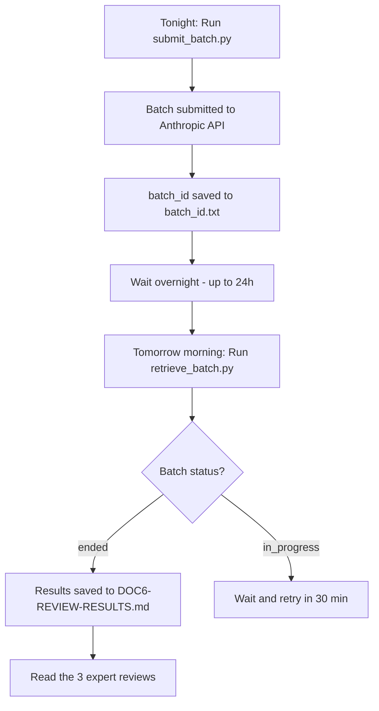

# Plan: Anthropic Batch API Review of DOC6

**Date:** 2026-03-27  
**Document under review:** [`workbench/DOC6-PRD-AGENTIC-AGILE-PROCESS.md`](../../workbench/DOC6-PRD-AGENTIC-AGILE-PROCESS.md)  
**Model:** `claude-sonnet-4-6`  
**API:** Anthropic Message Batches API (50% cost reduction vs synchronous)

---

## Overview

This plan describes how to submit a rigorous, multi-perspective review of DOC6 to the Anthropic Batch API tonight, and retrieve the results tomorrow morning.

---

## Workflow



---

## The 3 Review Requests

We submit **3 parallel requests** in a single batch — one per expert persona:

| Custom ID | Expert Persona | Focus |
|---|---|---|
| `review-coherence` | Senior Technical Writer | Document coherence, structure, clarity, internal consistency |
| `review-architecture` | Principal Software Architect | Architecture soundness, gaps, scalability, security |
| `review-implementation` | Senior Platform Engineer | Feasibility, tooling choices, MCP ecosystem, 3-tier design |

Each request uses a **structured system prompt** that forces the model to produce:
- An executive summary (3-5 bullet points)
- A detailed section-by-section analysis
- A prioritized list of improvements (P0/P1/P2)
- A verdict (Ready / Needs revision / Major rework required)

---

## Files in This Directory

| File | Purpose |
|---|---|
| [`submit_batch.py`](submit_batch.py) | Reads DOC6, builds the 3-request batch payload, submits to Anthropic, saves `batch_id` |
| [`retrieve_batch.py`](retrieve_batch.py) | Polls batch status, downloads results, writes `DOC6-REVIEW-RESULTS.md` |
| [`batch_id.txt`](batch_id.txt) | Auto-generated by `submit_batch.py` — contains the batch ID for retrieval |
| [`DOC6-REVIEW-RESULTS.md`](DOC6-REVIEW-RESULTS.md) | Auto-generated by `retrieve_batch.py` — contains the 3 expert reviews |

---

## Prerequisites

1. `ANTHROPIC_API_KEY` must be set as an environment variable:
   ```powershell
   $env:ANTHROPIC_API_KEY = "sk-ant-..."
   ```
2. The `anthropic` Python package must be installed:
   ```powershell
   pip install anthropic
   ```
3. Run from the **workspace root** (`c:/Users/nghia/AGENTIC_DEVELOPMENT_PROJECTS/agentic-agile-workbench`).

---

## Step-by-Step Instructions

### Tonight — Submit the Batch

```powershell
python plans/batch-doc6-review/submit_batch.py
```

Expected output:
```
Submitting batch with 3 requests to model claude-sonnet-4-6...

✅ Batch submitted successfully!
   Batch ID  : msgbatch_...
   Status    : in_progress
   Created at: 2026-03-27T...
   Expires at: 2026-04-03T...

Saving batch_id to plans/batch-doc6-review/batch_id.txt...
✅ batch_id saved. Run retrieve_batch.py tomorrow morning to get the results.
```

### Tomorrow Morning — Retrieve the Results

```powershell
python plans/batch-doc6-review/retrieve_batch.py
```

If the batch is complete, results are written to [`plans/batch-doc6-review/DOC6-REVIEW-RESULTS.md`](DOC6-REVIEW-RESULTS.md).

If still processing:
```
⏳ Batch status: in_progress. Try again in 30 minutes.
```

---

## Model Parameters

| Parameter | Value | Rationale |
|---|---|---|
| `model` | `claude-sonnet-4-6` | Best balance of quality and cost for long-form analysis |
| `max_tokens` | `4096` | Sufficient for a detailed structured review per expert |
| `temperature` | default (1.0) | Creative analysis is desired — not deterministic JSON extraction |
| `system` | Expert persona prompt | Forces structured output with P0/P1/P2 prioritization |

---

## Cost Estimate

- Batch API = 50% of standard pricing
- DOC6 = ~410 lines ≈ ~3,500 input tokens per request
- 3 requests × ~3,500 input tokens = ~10,500 input tokens total
- Output: 3 × 4,096 max tokens = ~12,288 output tokens max
- **Total cost: well under $0.10** at Batch API pricing for Sonnet

---

## Notes

- The `batch_id.txt` and `DOC6-REVIEW-RESULTS.md` files are gitignored by default (they are generated artifacts). Add them to git manually if you want to version the results.
- Batches expire after **29 days** if not retrieved.
- The Anthropic Batch API processes requests within **24 hours** (typically 1-4 hours for small batches).
