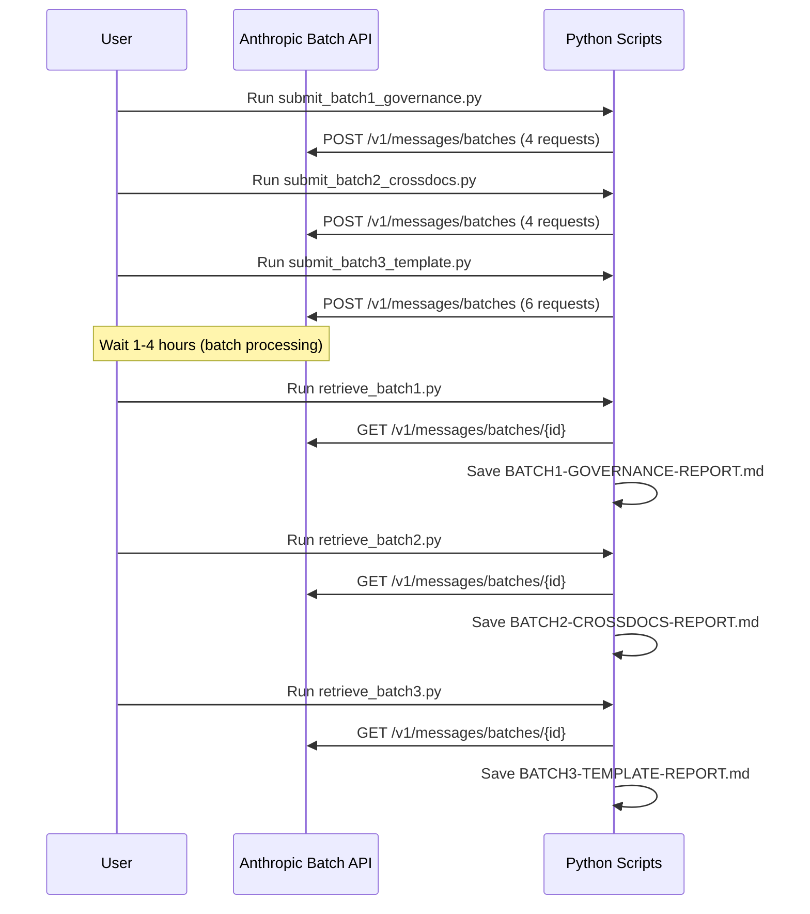

# Plan: Full Coherence Audit via Anthropic Batch API (Async)

**Date:** 2026-03-28
**Scope:** Full project — all categories (docs/, memory-bank/, prompts/, src/, config files, template/)
**API:** Anthropic Message Batches API (**50% cost reduction** vs synchronous)
**Model:** `claude-sonnet-4-6`
**Cost target:** <$0.50 total for all batches

---

## Overview

This plan describes a comprehensive, multi-batch coherence audit of the entire Agentic Agile Workbench project using the Anthropic Batch API in asynchronous mode. The audit is split into **3 independent batches** that can run in parallel, covering 4 distinct coherence dimensions.

**Key benefit:** Batch API processing is **50% cheaper** than synchronous API calls, and all requests in a batch are processed asynchronously (up to 24h wait, typically 1-4h).

---

## Architecture: 3 Independent Batches

```mermaid
flowchart TD
    subgraph BATCH 1 ["🔒 Governance Coherence Batch"]
        G1[SP-001..010 vs .clinerules]
        G2[SP-001..010 vs .roomodes]
        G3[prompts/README.md vs SP-XXX]
    end

    subgraph BATCH 2 ["📄 Cross-Document Coherence Batch"]
        C1[DOC-1..5 intra-release v2.2]
        C2[Version drift v1.0→v2.0→v2.1→v2.2]
        C3[DOC-CURRENT pointers vs releases/]
    end

    subgraph BATCH 3 ["🗂️ Template Coherence Batch"]
        T1[root vs template/.clinerules]
        T2[root vs template/.roomodes]
        T3[root vs template/Modelfile]
        T4[template/ vs DOC-2 Architecture]
    end

    BATCH 1 --> R1[Governance Report]
    BATCH 2 --> R2[Cross-Docs Report]
    BATCH 3 --> R3[Template Report]
    R1 --> FINAL[Consolidated Audit Report]
    R2 --> FINAL
    R3 --> FINAL
```

---

## The 4 Coherence Dimensions

### Dimension 1: Governance Coherence (BATCH 1)

**Question:** Are `.clinerules`, `.roomodes`, `Modelfile`, and `prompts/SP-*.md` all in sync with each other?

| Custom ID | Focus | Files Compared |
|---|---|---|
| `gov-sp-clinerules` | SP prompts vs .clinerules rule definitions | `prompts/SP-*.md` ↔ `.clinerules` |
| `gov-sp-roomodes` | SP prompts vs .roomodes persona definitions | `prompts/SP-*.md` ↔ `.roomodes` |
| `gov-readme-sp` | prompts/README.md registry vs actual SP files | `prompts/README.md` ↔ `prompts/SP-*.md` |
| `gov-template-root` | template/ files vs root files | `template/.clinerules` ↔ `.clinerules` |

**Known issues to check:**
- `.clinerules` line 1 has BOM (``) and corrupted em-dash (`â€"`)
- `template/.clinerules` has normalized em-dashes but different line structure
- RULE 10 GitFlow Enforcement contains `\n` literal backslash-n (should be real newlines)

### Dimension 2: Cross-Document Consistency (BATCH 2)

**Question:** Are DOC-1..5 internally consistent within each release, and do cross-release references stay valid?

| Custom ID | Focus | Files Compared |
|---|---|---|
| `xd-doc12-v22` | PRD (DOC-1) vs Architecture (DOC-2) in v2.2 | `DOC-1-v2.2` ↔ `DOC-2-v2.2` |
| `xd-doc23-v22` | Architecture (DOC-2) vs Implementation (DOC-3) in v2.2 | `DOC-2-v2.2` ↔ `DOC-3-v2.2` |
| `xd-version-drift` | Version drift across v1.0→v2.0→v2.1→v2.2 | All 4 DOC-1 sets |
| `xd-current-pointers` | DOC-CURRENT.md pointers vs actual release files | `DOC-*-CURRENT.md` ↔ `releases/vX.Y/` |

### Dimension 3: Template vs Root Consistency (BATCH 3)

**Question:** Are the root configuration files identical to their template counterparts (modulo project-specific values)?

| Custom ID | Focus | Files Compared |
|---|---|---|
| `tmpl-clinerules` | Root vs template .clinerules | `.clinerules` ↔ `template/.clinerules` |
| `tmpl-roomodes` | Root vs template .roomodes | `.roomodes` ↔ `template/.roomodes` |
| `tmpl-modelfile` | Root vs template Modelfile | `Modelfile` ↔ `template/Modelfile` |
| `tmpl-proxy` | Root vs template proxy.py | `proxy.py` ↔ `template/proxy.py` |

### Dimension 4: Implementation vs Documentation (BATCH 3 continued)

**Question:** Does the implemented code match what's documented in DOC-2 (Architecture)?

| Custom ID | Focus | Files Compared |
|---|---|---|
| `impl-src-calypso` | Calypso scripts vs DOC-2 Phase 2 description | `src/calypso/*.py` ↔ `DOC-2-v2.2` |
| `impl-memory-bank` | Memory Bank structure vs DOC-2 Section 4 | `memory-bank/` ↔ `DOC-2-v2.2` |

---

## Files to Create

```
plans/batch-full-audit/
├── PLAN-full-coherence-audit.md          ← This file
├── RUNBOOK.md                            ← Execution instructions
├── submit_batch1_governance.py           ← BATCH 1: Governance
├── retrieve_batch1.py                     ← BATCH 1 retrieval
├── submit_batch2_crossdocs.py            ← BATCH 2: Cross-Docs
├── retrieve_batch2.py                     ← BATCH 2 retrieval
├── submit_batch3_template.py             ← BATCH 3: Template + Impl
├── retrieve_batch3.py                     ← BATCH 3 retrieval
├── batch_id_*.txt                         ← (generated: batch IDs)
└── RESULTS/
    ├── BATCH1-GOVERNANCE-REPORT.md       ← (generated)
    ├── BATCH2-CROSSDOCS-REPORT.md         ← (generated)
    └── BATCH3-TEMPLATE-REPORT.md          ← (generated)
```

---

## Execution Workflow



---

## Prerequisites

1. `ANTHROPIC_API_KEY` must be set:
   ```powershell
   $env:ANTHROPIC_API_KEY = "sk-ant-..."
   ```
2. Install the `anthropic` package:
   ```powershell
   pip install anthropic
   ```
3. Run all scripts from the **workspace root**:
   ```
   c:/Users/nghia/AGENTIC_DEVELOPMENT_PROJECTS/agentic-agile-workbench
   ```

---

## Cost Estimate

| Batch | Requests | Est. Input Tokens | Est. Output Tokens | Batch API Cost |
|-------|----------|-------------------|-------------------|----------------|
| BATCH 1 | 4 | ~15,000 | ~16,000 | ~$0.05 |
| BATCH 2 | 4 | ~25,000 | ~16,000 | ~$0.07 |
| BATCH 3 | 6 | ~30,000 | ~24,000 | ~$0.09 |
| **TOTAL** | **14** | **~70,000** | **~56,000** | **~$0.21** |

At Batch API pricing (50% of standard). **All 3 batches in parallel = same cost as sequential.**

---

## Model Parameters

| Parameter | Value | Rationale |
|---|---|---|
| `model` | `claude-sonnet-4-6` | Best quality/cost for structured analysis |
| `max_tokens` | `4096` | Sufficient for detailed structured reports |
| `temperature` | `0.3` | Low temperature for consistent analysis |
| `system` | Expert persona prompt | Forces structured output with P0/P1/P2 |

---

## Output Format (Per Request)

Each batch request produces a structured report:

```
## 1. Executive Summary
3-5 bullet points

## 2. Findings
Detailed findings with file:line references

## 3. Inconsistencies Found
| Severity | Location | Description | Expected | Actual |
|---|---|---|---|---|
| P0 | file:line | description | expected | actual |

## 4. Prioritized Remediation
- **P0 (Critical):** Must fix before next release
- **P1 (Important):** Should fix in next sprint
- **P2 (Nice to have):** Fix when convenient

## 5. Verdict
[CONSISTENT] / [MINOR_ISSUES] / [MAJOR_INCONSISTENCIES]
```

---

## Next Steps After Audit

1. **Consolidate** all 3 reports into `docs/qa/v2.3/COHERENCE-AUDIT-v2.3.md`
2. **Triage** findings using IDEA capture process (RULE 8.2)
3. **Fix P0 issues** in a dedicated feature branch
4. **Commit** fixes with Conventional Commits
5. **Update** `docs/releases/v2.3/` canonical docs if needed

---

## Notes

- All `batch_id_*.txt` and `RESULTS/*.md` files are generated artifacts (gitignore by default)
- Batches expire after **29 days** if not retrieved
- Batch processing typically completes in **1-4 hours** (max 24h)
- 3 batches can be submitted simultaneously — they process independently
