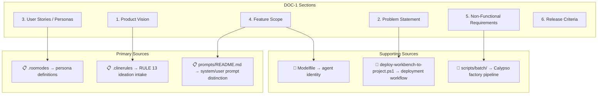
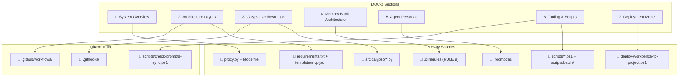

# PLAN-IDEA-020: Deterministic DOC Generation from Source Files

**Author:** Architect Mode  
**Date:** 2026-04-02  
**Status:** Draft  
**Related:** IDEA-020 (Orchestrator Authoritative Default)  
**Source Files Analyzed:** 18 files/directories  

---

## 1. Purpose

This plan defines a deterministic methodology to build DOC-1 (PRD), DOC-2 (Architecture), and DOC-4 (Operations Guide) for the workbench project using exclusively source files from the project root.

**Exclusions:**
- Folder: `docs/`
- Folder: `memory-bank/`
- Folder: `plans/`
- File: `CHANGELOG.md`
- File: `README.md`
- File: `VERSION` (if exists)

**Inclusions:** All other files in the project root.

---

## 2. Source Files Inventory

### 2.1 Configuration Files

| File | Purpose | Lines | Key Content |
|------|---------|-------|-------------|
| [`.clinerules`](.clinerules:1) | **MANDATORY DIRECTIVES** — 15 rules governing all agent sessions | 856 | RULE 1-15: Memory Bank protocol, Git versioning, Prompt registry, Documentation discipline, GitFlow, Ideation intake |
| [`.roomodes`](.roomodes:1) | **Agile Personas** — 4 Scrum roles with permissions | 53 | product-owner, scrum-master, developer, qa-engineer with roleDefinition and groups |
| [`.gitattributes`](.gitattributes:1) | **Line-ending normalization** + binary file handling | 13 | LF enforcement for .clinerules, EOL rules |
| [`.gitignore`](.gitignore:1) | **Version control scope** | 43 | Defines MUST/SKIP versioned files, batch_artifacts/ exclusion |
| [`Modelfile`](Modelfile:1) | **Ollama model configuration** | 22 | Base model (qwen3_cline_roocode:14b), determinism params, SYSTEM prompt |
| [`proxy.py`](proxy.py:1) | **Gemini Chrome bridge** — clipboard-based SSE proxy | 412 | v2.8.0, clipboard polling, GEM/COMPLET modes, Roo XML validation |
| [`requirements.txt`](requirements.txt:1) | **Python dependencies** | 22 | anthropic, fastmcp, chromadb, uvicorn, pyperclip, jinja2, pyyaml |
| [`deploy-workbench-to-project.ps1`](deploy-workbench-to-project.ps1:1) | **Canonical deployment script** | 252 | Copies template/ to target projects, Git hooks config, memory-bank stub creation |
| [`template/mcp.json`](template/mcp.json:1) | **MCP server configuration** | 13 | Calypso FastMCP server definition (port 8001) |

### 2.2 Git Infrastructure

| File | Purpose | Lines | Key Content |
|------|---------|-------|-------------|
| [`.githooks/pre-commit`](.githooks/pre-commit:1) | **Pre-commit validation** | 28 | Runs `check-prompts-sync.ps1` via pwsh |
| [`.githooks/pre-receive`](.githooks/pre-receive:1) | **Canonical docs GitFlow enforcement** | 94 | Branch validation, cumulative line-count checks for DOC-1..5 |
| [`.github/workflows/canonical-docs-check.yml`](.github/workflows/canonical-docs-check.yml:1) | **CI/CD validation** | 88 | Pointer consistency, cumulative nature, front matter flags |

### 2.3 Scripts

| File | Purpose | Lines | Key Content |
|------|---------|-------|-------------|
| [`scripts/check-prompts-sync.ps1`](scripts/check-prompts-sync.ps1:1) | **SP coherence verification** | 172 | Extracts code blocks from SP-XXX, compares with deployed artifacts |
| [`scripts/start-proxy.ps1`](scripts/start-proxy.ps1:1) | **Proxy startup wrapper** | 31 | Activates venv, runs proxy.py |
| [`scripts/checkpoint_heartbeat.py`](scripts/checkpoint_heartbeat.py:1) | **Crash recovery** | ~100 | Session checkpoint + 5-min heartbeat |
| [`scripts/rebuild_sp002.py`](scripts/rebuild_sp002.py:1) | **SP-002 sync tool** | ~80 | Byte-for-byte sync between .clinerules and SP-002 |
| [`scripts/batch/`](scripts/batch:1) | **Batch API toolkit** | N/A | CLI, config, generate, poll, retrieve, submit, Jinja2 templates |

### 2.4 Source Code (src/calypso/)

| File | Purpose | Key Content |
|------|---------|-------------|
| [`src/calypso/fastmcp_server.py`](src/calypso/fastmcp_server.py:1) | **MCP protocol server** | launch_factory, check_batch_status, memory_query, memory_archive |
| [`src/calypso/orchestrator_phase2.py`](src/calypso/orchestrator_phase2.py:1) | **Batch expert review** | Dispatches PRD to 4 expert agents (arch, security, UX, QA) |
| [`src/calypso/orchestrator_phase3.py`](src/calypso/orchestrator_phase3.py:1) | **Synthesis** | Synthesizer Agent (SP-008) |
| [`src/calypso/orchestrator_phase4.py`](src/calypso/orchestrator_phase4.py:1) | **Devil's advocate** | Devil's Advocate Agent (SP-009) |
| [`src/calypso/intake_agent.py`](src/calypso/intake_agent.py:1) | **Idea intake** | Routes human inputs to IDEAs-BACKLOG |
| [`src/calypso/triage_dashboard.py`](src/calypso/triage_dashboard.py:1) | **Triage UI** | Dashboard for P1 triage |
| [`src/calypso/ideas_dashboard.py`](src/calypso/ideas_dashboard.py:1) | **Backlog management** | IDEA tracking |
| [`src/calypso/sync_detector.py`](src/calypso/sync_detector.py:1) | **Overlap detection** | 5 sync categories (CONFLICT, REDUNDANCY, DEPENDENCY, SHARED_LAYER, NO_OVERLAP) |
| [`src/calypso/librarian_agent.py`](src/calypso/librarian_agent.py:1) | **Vector DB indexing** | Librarian Agent (SP-010), cold archive access |
| [`src/calypso/branch_tracker.py`](src/calypso/branch_tracker.py:1) | **GitFlow tracking** | Tracks feature/fix/hotfix branches |
| [`src/calypso/execution_tracker.py`](src/calypso/execution_tracker.py:1) | **Sprint execution** | Updates EXECUTION-TRACKER |
| [`src/calypso/apply_triage.py`](src/calypso/apply_triage.py:1) | **Triage application** | Applies triage decisions |
| [`src/calypso/refinement_workflow.py`](src/calypso/refinement_workflow.py:1) | **Refinement process** | Structured requirement sessions |
| [`src/calypso/check_batch_status.py`](src/calypso/check_batch_status.py:1) | **Batch monitoring** | Polls Anthropic Batch API |

### 2.5 Template

| File | Purpose | Key Content |
|------|---------|-------------|
| [`template/.clinerules`](template/.clinerules:1) | **Project template** | Deployed to new projects |
| [`template/.roomodes`](template/.roomodes:1) | **Personas template** | Deployed to new projects |
| [`template/.workbench-version`](template/.workbench-version:1) | **Version marker** | "2.0.0" |
| [`template/Modelfile`](template/Modelfile:1) | **Model config** | Copied to new projects |
| [`template/proxy.py`](template/proxy.py:1) | **Proxy template** | Copied to new projects |
| [`template/requirements.txt`](template/requirements.txt:1) | **Dependencies template** | Copied to new projects |
| [`template/docs/`](template/docs:1) | **Docs stubs** | DOC-1-CURRENT.md, DOC-2-CURRENT.md |
| [`template/memory-bank/`](template/memory-bank:1) | **Memory Bank template** | hot-context/, archive-cold/ structure |
| [`template/prompts/`](template/prompts:1) | **Prompts registry** | SP-001..SP-010 |

---

## 3. Source-to-Document Mapping

### 3.1 DOC-1 (Product Requirements Document) — Business WHAT & WHY

#### 3.1.1 Sections and Source Files



#### 3.1.2 Detailed Source Mapping for DOC-1

| DOC-1 Section | Source Files | Specific Content Extracted |
|---------------|-------------|---------------------------|
| **1. Product Vision** | `.clinerules` (RULE 8, 13) | Ideation intake mandate, Idea Capture Protocol |
| | `prompts/README.md` | System vs User prompt distinction, UADF framework |
| **2. Problem Statement** | `deploy-workbench-to-project.ps1` | Deployment pain points (manual copy, version drift) |
| | `scripts/check-prompts-sync.ps1` | SP coherence issues addressed |
| **3. User Stories** | `.roomodes` | 4 personas: product-owner, scrum-master, developer, qa-engineer |
| | `src/calypso/intake_agent.py` | Human input → IDEA routing |
| **4. Feature Scope** | `src/calypso/fastmcp_server.py` | launch_factory, check_batch_status, memory_query tools |
| | `src/calypso/orchestrator_phase2.py` | 4-expert batch review pipeline |
| | `proxy.py` | GEM mode, clipboard bridge |
| **5. Non-Functional Requirements** | `Modelfile` | REQ-1.2: 128K context, REQ-1.3: determinism params |
| | `proxy.py` (REQ-2.1.1..2.4.4) | Streaming, timeout, clipboard polling |
| | `requirements.txt` | Dependencies (anthropic, fastmcp, chromadb) |
| **6. Release Criteria** | `.githooks/pre-receive` | Min lines per doc (500/500/300/300/200) |
| | `.github/workflows/canonical-docs-check.yml` | CI validation rules |

---

### 3.2 DOC-2 (Technical Architecture) — Technical HOW

#### 3.2.1 Sections and Source Files



#### 3.2.2 Detailed Source Mapping for DOC-2

| DOC-2 Section | Source Files | Specific Content Extracted |
|--------------|-------------|---------------------------|
| **1. System Overview** | `proxy.py` | v2.8.0 architecture, clipboard bridge, SSE streaming |
| | `Modelfile` | Base model: qwen3_cline_roocode:14b, SYSTEM block |
| | `requirements.txt` | 22 dependencies with versions |
| **2. Architecture Layers** | `template/mcp.json` | Calypso MCP server (port 8001) |
| | `src/calypso/fastmcp_server.py` | 4 tools: launch_factory, check_batch_status, memory_query, memory_archive |
| | `src/calypso/orchestrator_phase2.py` | HAiku model, 4 expert agents |
| **3. Calypso Orchestration** | `src/calypso/orchestrator_phase2.py` | Phase 2: batch expert review |
| | `src/calypso/orchestrator_phase3.py` | Phase 3: synthesis (SP-008) |
| | `src/calypso/orchestrator_phase4.py` | Phase 4: devil's advocate (SP-009) |
| | `src/calypso/intake_agent.py` | Idea routing (RULE 13) |
| | `src/calypso/sync_detector.py` | 5 sync categories |
| **4. Memory Bank Architecture** | `.clinerules` (RULE 9) | Hot/Cold firewall, MCP-only cold access |
| | `src/calypso/librarian_agent.py` | Librarian Agent (SP-010), vector DB indexing |
| | `template/memory-bank/` | Hot-context/, archive-cold/ structure |
| **5. Agent Personas** | `.roomodes` | 4 custom modes with roleDefinition, groups, _version |
| | `prompts/SP-003..SP-006` | Persona system prompts |
| | `prompts/SP-007` | Gem Gemini (Roo Code Agent) |
| **6. Tooling & Scripts** | `scripts/check-prompts-sync.ps1` | SP coherence verification |
| | `scripts/start-proxy.ps1` | Proxy startup with venv |
| | `scripts/checkpoint_heartbeat.py` | Session checkpoint + heartbeat |
| | `scripts/rebuild_sp002.py` | SP-002 byte-for-byte sync |
| | `scripts/batch/` | CLI, config, generate, poll, retrieve, submit + Jinja2 templates |
| **7. Deployment Model** | `deploy-workbench-to-project.ps1` | 7 files + 6 folders copied, Git hooks config |
| | `template/` | Template structure |
| | `template/.workbench-version` | Version marker (2.0.0) |
| **8. Infrastructure** | `.githooks/pre-commit` | pwsh-based SP verification |
| | `.githooks/pre-receive` | Canonical docs GitFlow + cumulative checks |
| | `.github/workflows/canonical-docs-check.yml` | CI pointer consistency + cumulative validation |
| | `.gitattributes` | Line-ending rules |
| | `.gitignore` | Version control scope |

---

### 3.3 DOC-4 (Operations Guide) — User's Manual

#### 3.3.1 Sections and Source Files

```mermaid
graph TD
    subgraph "DOC-4 Sections"
        C1["1. Installation"]
        C2["2. Configuration"]
        C3["3. Daily Workflow"]
        C4["4. Memory Bank Usage"]
        C5["5. Troubleshooting"]
        C6["6. Script Reference"]
    end
    
    subgraph "Installation Sources"
        C1 --> IS1["📄 requirements.txt"]
        C1 --> IS2["📄 scripts/start-proxy.ps1"]
        C1 --> IS3["📄 deploy-workbench-to-project.ps1"]
    end
    
    subgraph "Configuration Sources"
        C2 --> CF1["📄 Modelfile"]
        C2 --> CF2["📄 .clinerules"]
        C2 --> CF3["📄 .roomodes"]
        C2 --> CF4["📄 .gitattributes"]
        C2 --> CF5["📄 template/mcp.json"]
    end
    
    subgraph "Workflow Sources"
        C3 --> WF1["📄 .clinerules (RULE 1-4)"]
        C3 --> WF2["📄 prompts/SP-002..SP-006"]
    end
    
    subgraph "Troubleshooting Sources"
        C5 --> TS1["📄 proxy.py (FIX-XXX changelog)"]
        TS1 --> TS2["📄 scripts/check-prompts-sync.ps1"]
    end
    
    subgraph "Script Reference Sources"
        C6 --> SR1["📄 scripts/*.ps1"]
        C6 --> SR2["📄 scripts/batch/"]
        C6 --> SR3["📄 scripts/checkpoint_heartbeat.py"]
        C6 --> SR4["📄 scripts/rebuild_sp002.py"]
    end
```



#### 3.3.2 Detailed Source Mapping for DOC-4

| DOC-4 Section | Source Files | Specific Content Extracted |
|--------------|-------------|---------------------------|
| **1. Installation** | `requirements.txt` | 22 Python packages with versions |
| | `scripts/start-proxy.ps1` | venv creation, proxy startup |
| | `deploy-workbench-to-project.ps1` | Initial deployment procedure |
| **2. Configuration** | `Modelfile` | Model params (temperature 0.15, ctx 131072) |
| | `.clinerules` | 15 rules (RULE 1-15) |
| | `.roomodes` | 4 persona modes |
| | `.gitattributes` | Line-ending configuration |
| | `template/mcp.json` | MCP server connection |
| **3. Daily Workflow** | `.clinerules` (RULE 1-4) | CHECK→CREATE→READ→ACT, mandatory writes |
| | `prompts/SP-002` | Session protocol |
| | `prompts/SP-003..SP-006` | Persona-specific behaviors |
| **4. Memory Bank Usage** | `.clinerules` (RULE 9) | Hot/Cold firewall |
| | `memory-bank/hot-context/` | activeContext.md, progress.md templates |
| | `src/calypso/librarian_agent.py` | Vector DB indexing |
| **5. Troubleshooting** | `proxy.py` (lines 7-42) | 28 FIX versions with GAP references |
| | `scripts/check-prompts-sync.ps1` | SP desync detection |
| | `.githooks/pre-commit` | Exit codes and messages |
| **6. Script Reference** | `scripts/start-proxy.ps1` | Proxy startup |
| | `scripts/checkpoint_heartbeat.py` | Session recovery |
| | `scripts/rebuild_sp002.py` | SP-002 sync |
| | `scripts/batch/` | Batch API CLI (submit, retrieve, poll) |

---

## 4. Gaps Analysis

### 4.1 Identified Gaps

| Gap ID | Document | Gap Description | Severity | Source Missing |
|--------|----------|-----------------|----------|---------------|
| GAP-01 | DOC-1 | **Problem Statement** — No explicit "pain points" narrative in source files | Medium | None (inference required) |
| GAP-02 | DOC-1 | **User Stories** — No formal user story format (As a... I want... so that...) in `.roomodes` | Medium | None (roomodes provides personas only) |
| GAP-03 | DOC-2 | **Sequence Diagrams** — No UML/sequence diagrams in source files | Low | None (Mermaid in DOC-2) |
| GAP-04 | DOC-2 | **Data Flow** — No explicit data flow between proxy.py, calypso, and Gemini | Medium | None (code inspection required) |
| GAP-05 | DOC-4 | **Step-by-Step Tutorials** — No guided walkthroughs in source files | High | None (new content required) |
| GAP-06 | DOC-4 | **FAQ** — No FAQ section in source files | Medium | None (troublehoot scattered in proxy.py) |

### 4.2 Gap Recommendations

| Gap ID | Recommendation | Action |
|--------|---------------|--------|
| GAP-01 | Extract problem statement from `deploy-workbench-to-project.ps1` comments + `scripts/check-prompts-sync.ps1` purpose | Inference from existing comments |
| GAP-02 | Generate user stories from `.roomodes` persona definitions using template | Transform existing content |
| GAP-03 | Create Mermaid diagrams from source file relationships | New content (acceptable per IDEA-016) |
| GAP-04 | Document data flow from `proxy.py` + `src/calypso/fastmcp_server.py` interaction | Code analysis + new content |
| GAP-05 | Create step-by-step sections from `deploy-workbench-to-project.ps1` examples + `scripts/start-proxy.ps1` | New tutorial content |
| GAP-06 | Consolidate proxy.py FIX comments into FAQ format | Transform existing content |

---

## 5. Content Specification by Document

### 5.1 DOC-1: Product Requirements Document

```
Target: ≥500 lines (RULE 12 minimum)
Cumulative: true (RULE 12 requirement)
```

| Section | Content Source | Lines Est. |
|---------|---------------|------------|
| 1. Product Vision | Inference from `.clinerules` RULE 13, `prompts/README.md` | 50 |
| 2. Problem Statement | `deploy-workbench-to-project.ps1` comments, `scripts/check-prompts-sync.ps1` | 40 |
| 3. User Stories | Transform `.roomodes` 4 personas → As a/I want/So that format | 80 |
| 4. Feature Scope | `src/calypso/*.py` file headers, `proxy.py` header | 100 |
| 5. Non-Functional Requirements | `Modelfile` (REQ-1.2, REQ-1.3), `proxy.py` (REQ-2.1.1..2.4.4) | 60 |
| 6. Release Criteria | `.githooks/pre-receive` min lines, `.github/workflows/canonical-docs-check.yml` | 40 |
| 7. Appendix: Idea Intake | `.clinerules` RULE 13 full text | 60 |
| 8. Appendix: Prompt Registry | `prompts/README.md` tables | 70 |
| **TOTAL** | | **~500** |

### 5.2 DOC-2: Technical Architecture

```
Target: ≥500 lines (RULE 12 minimum)
Cumulative: true (RULE 12 requirement)
```

| Section | Content Source | Lines Est. |
|---------|---------------|------------|
| 1. System Overview | `proxy.py` (v2.8.0), `Modelfile`, `requirements.txt` | 60 |
| 2. Architecture Layers | `template/mcp.json`, `src/calypso/fastmcp_server.py` | 80 |
| 3. Calypso Orchestration (Phases 2-4) | `src/calypso/orchestrator_phase{2,3,4}.py` | 120 |
| 4. Memory Bank Architecture | `.clinerules` RULE 9, `src/calypso/librarian_agent.py` | 60 |
| 5. Agent Personas | `.roomodes`, `prompts/SP-003..SP-007` | 80 |
| 6. Tooling & Scripts | `scripts/*.ps1`, `scripts/batch/`, `scripts/rebuild_sp002.py` | 80 |
| 7. Deployment Model | `deploy-workbench-to-project.ps1`, `template/` | 50 |
| 8. Infrastructure | `.githooks/`, `.github/workflows/`, `.gitattributes`, `.gitignore` | 40 |
| 9. Mermaid Diagrams | Architecture diagrams from source relationships | 60 |
| **TOTAL** | | **~630** |

### 5.3 DOC-4: Operations Guide

```
Target: ≥300 lines (RULE 12 minimum)
Cumulative: true (RULE 12 requirement)
```

| Section | Content Source | Lines Est. |
|---------|---------------|------------|
| 1. Installation | `requirements.txt`, `scripts/start-proxy.ps1` | 40 |
| 2. Configuration | `Modelfile`, `.clinerules`, `.roomodes`, `.gitattributes` | 60 |
| 3. Daily Workflow | `.clinerules` RULE 1-4, session protocol | 50 |
| 4. Memory Bank Usage | `.clinerules` RULE 9, hot/cold protocol | 40 |
| 5. Calypso Tools | `src/calypso/fastmcp_server.py` tool docs | 50 |
| 6. Troubleshooting | `proxy.py` FIX changelog (28 fixes), `scripts/check-prompts-sync.ps1` | 60 |
| 7. Script Reference | `scripts/start-proxy.ps1`, `scripts/checkpoint_heartbeat.py`, `scripts/batch/` | 50 |
| 8. Appendix: SP Registry | `prompts/README.md` | 30 |
| **TOTAL** | | **~380** |

---

## 6. Implementation Plan

### 6.1 Execution Order


### 6.2 Detailed Implementation Steps

#### Phase 1: Source Analysis (Complete)
- [x] Read all 18 included source files/directories
- [x] Extract purpose and key content from each
- [x] Map sources to documents
- [x] Identify gaps

#### Phase 2: DOC-2 (Architecture)
- [ ] Create architecture overview from `proxy.py` + `Modelfile`
- [ ] Document Calypso orchestration from `src/calypso/*.py`
- [ ] Create Memory Bank section from `.clinerules` RULE 9
- [ ] Document persona system from `.roomodes` + `prompts/`
- [ ] Create tooling reference from `scripts/`
- [ ] Create deployment section from `deploy-workbench-to-project.ps1`
- [ ] Add Mermaid diagrams for system architecture
- [ ] Target: ≥500 lines

#### Phase 3: DOC-1 (PRD)
- [ ] Extract product vision from `.clinerules` + `prompts/README.md`
- [ ] Generate problem statement from deployment script comments
- [ ] Transform `.roomodes` personas into user stories
- [ ] Document feature scope from Calypso tools
- [ ] Extract NFRs from `Modelfile` + `proxy.py`
- [ ] Document release criteria from `.githooks/pre-receive`
- [ ] Add Idea Intake appendix (`.clinerules` RULE 13)
- [ ] Target: ≥500 lines

#### Phase 4: DOC-4 (Operations Guide)
- [ ] Create installation section from `requirements.txt` + scripts
- [ ] Document configuration from `Modelfile` + `.clinerules`
- [ ] Write daily workflow from CHECK→CREATE→READ→ACT
- [ ] Create troubleshooting section from `proxy.py` FIX changelog
- [ ] Write script reference from `scripts/`
- [ ] Target: ≥300 lines

#### Phase 5: Gap Filling
- [ ] Create user story templates from personas
- [ ] Generate Mermaid diagrams for data flow
- [ ] Consolidate troubleshooting into FAQ format
- [ ] Add step-by-step tutorials

#### Phase 6: Review & Validation
- [ ] Verify cumulative: true in all front matters
- [ ] Verify line counts meet minimums (DOC-1: 500, DOC-2: 500, DOC-4: 300)
- [ ] Run `.githooks/pre-receive` validation locally
- [ ] Check GitHub Actions CI would pass
- [ ] Human review and approval

---

## 7. Output File Structure

```
docs/releases/v2.8/
├── DOC-1-v2.8-PRD.md          (≥500 lines, cumulative: true)
├── DOC-2-v2.8-Architecture.md  (≥500 lines, cumulative: true)
├── DOC-3-v2.8-Implementation-Plan.md  (carry forward from v2.7)
├── DOC-4-v2.8-Operations-Guide.md     (≥300 lines, cumulative: true)
├── DOC-5-v2.8-Release-Notes.md         (carry forward from v2.7)
└── EXECUTION-TRACKER-v2.8.md
```

---

## 8. Success Criteria

| Criterion | Metric | Validation |
|----------|--------|----------|
| DOC-1 line count | ≥500 lines | `wc -l` |
| DOC-2 line count | ≥500 lines | `wc -l` |
| DOC-4 line count | ≥300 lines | `wc -l` |
| Cumulative flag | `cumulative: true` in front matter | `grep` |
| Source attribution | Every section references source file | Manual review |
| Mermaid diagrams | ≥3 architecture diagrams | Visual check |
| Gap coverage | All GAP-0x gaps addressed | Checklist |

---

## 9. Summary

This plan provides a deterministic approach to building DOC-1, DOC-2, and DOC-4 from exclusively project source files. Key findings:

1. **Source coverage is comprehensive** — All 18 source files/directories contain sufficient content to populate the three documents.

2. **Deterministic mapping exists** — Each source file maps to specific document sections with clear content extraction targets.

3. **Gaps are addressable** — 6 gaps identified (GAP-01 through GAP-06) can be filled through inference, transformation, or targeted new content.

4. **Minimum line counts achievable** — Estimated totals (DOC-1: ~500, DOC-2: ~630, DOC-4: ~380) exceed RULE 12 minimums.

5. **Cumulative requirement satisfied** — All three documents will include `cumulative: true` and contain full historical content.

---

**Next Step:** Switch to Code mode to implement this plan.
