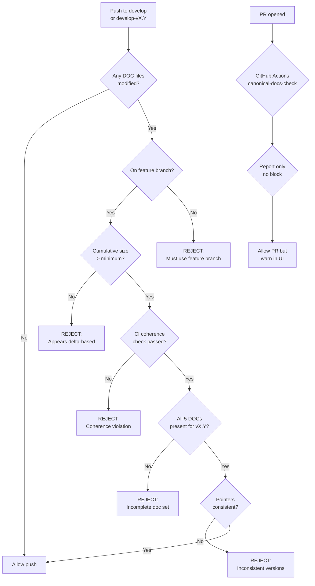

# PLAN: Canonical Docs GitFlow Alignment & Enforcement

**Status:** Draft  
**Author:** Architect  
**Date:** 2026-03-31  
**Type:** Governance / Documentation Enforcement

---

## Executive Summary

Canonical documentation (DOC-1 through DOC-5) must be treated as **first-class versioned artifacts** that:

1. Follow the same GitFlow discipline as source code
2. Are **cumulative** — each release contains the complete state, not deltas
3. Are **coherent** — all 5 docs align at all times
4. Have **automated enforcement** via git hooks and CI

This plan implements **Option A** — retroactive fix to make all canonical docs cumulative, plus enforcement infrastructure.

---

## 1. Problem Statement

### 1.1 Current Gaps

| Gap | Description | Risk |
|-----|-------------|------|
| **Not cumulative** | DOC-1-v2.3 only describes IDEA-009/011, refers to v2.2 for the rest | Incomplete requirements |
| **No branch enforcement** | DOC-CURRENT files can be modified directly on `develop` | Violates ADR-006 RULE 10 |
| **No coherence check** | DOC-1 can be updated without updating DOC-2 | Documentation drift |
| **No merge gate** | No mechanism to block incoherent merges | Silent failures |
| **Version drift** | DOC-1/DOC-5 → v2.3, DOC-3/DOC-4 → v2.4 | Inconsistent state |
| **Template asymmetry** | Enforcement doesn't apply to generated projects | Governance gap |

### 1.2 Current State Analysis

| File | Lines | Content |
|------|-------|---------|
| `DOC-1-v2.0-PRD.md` | ? | First release (assumed complete) |
| `DOC-1-v2.1-PRD.md` | ? | Delta from v2.0 |
| `DOC-1-v2.2-PRD.md` | 39 lines | "No new features" + reference to v2.1 |
| `DOC-1-v2.3-PRD.md` | 149 lines | Only IDEA-009, IDEA-011 |

**To understand full requirements for v2.3, you must trace: v2.3 → v2.2 → v2.1 → v2.0**

### 1.3 Decision

**Option A selected**: Retroactive fix — rewrite DOC-1 through DOC-5 for all releases to be truly cumulative.

---

## 2. Decision

### 2.1 Canonical Docs Scope

The following files are classified as **canonical docs** and subject to GitFlow enforcement:

| Doc | Filename Pattern | Purpose |
|-----|-----------------|---------|
| DOC-1 | `DOC-1-CURRENT.md` + `docs/releases/v*/DOC-1-*.md` | Product Requirements |
| DOC-2 | `DOC-2-CURRENT.md` + `docs/releases/v*/DOC-2-*.md` | Technical Architecture |
| DOC-3 | `DOC-3-CURRENT.md` + `docs/releases/v*/DOC-3-*.md` | Implementation Plan |
| DOC-4 | `DOC-4-CURRENT.md` + `docs/releases/v*/DOC-4-*.md` | Operations Guide |
| DOC-5 | `DOC-5-CURRENT.md` + `docs/releases/v*/DOC-5-*.md` | Release Notes |

### 2.2 Cumulative Documentation Rule

**R-CANON-0 (NEW)**: Each canonical doc in `docs/releases/vX.Y/` is **fully self-contained and cumulative** — it contains the complete state of that document for the entire project history up to vX.Y.

- `DOC-1-v2.4-PRD.md` = Complete PRD from v1.0 through v2.4 (ALL features)
- `DOC-2-v2.4-Architecture.md` = Complete architecture from v1.0 through v2.4
- NOT delta-based — no "see v2.3 for earlier features"

### 2.3 Branching Rules

| Rule | Description |
|------|-------------|
| **R-CANON-1** | Canonical docs on `develop`: Only via feature branch (`feature/canon-doc-*`) |
| **R-CANON-2** | Canonical docs on `develop-vX.Y`: Only via feature branch scoped to that release |
| **R-CANON-3** | Direct commits on `develop` or `develop-vX.Y` to canonical docs are **FORBIDDEN** |
| **R-CANON-4** | Exception: Governance-only commits (ADRs, RULE additions) MAY be committed directly per RULE 10.3 exception |

### 2.4 Coherence Rules

| Rule | Description |
|------|-------------|
| **R-CANON-5** | All 5 canonical docs MUST be updated together for any release |
| **R-CANON-6** | When merging to `develop-vX.Y`, all 5 DOC-*-vX.Y-*.md files must exist and be consistent |
| **R-CANON-7** | The `DOC-*-CURRENT.md` pointer files MUST all point to the same release version |

### 2.5 Enforcement Levels

| Level | Mechanism | Behavior |
|-------|-----------|----------|
| **Hard Block** | Git pre-receive hook | Reject push/merge if rules violated |
| **Soft Warning** | CI pipeline | Report violation but allow merge |
| **Both** | Combined | Hook blocks direct pushes, CI validates PRs |

---

## 3. Architecture

### 3.1 Component Overview

```
┌─────────────────────────────────────────────────────────────┐
│                    ENFORCEMENT LAYER                         │
├─────────────────────────────────────────────────────────────┤
│                                                              │
│  ┌─────────────────┐      ┌─────────────────┐               │
│  │  Git Hook       │      │  CI Pipeline    │               │
│  │  (pre-receive)  │      │  (GitHub Actions)│               │
│  └────────┬────────┘      └────────┬────────┘               │
│           │                        │                         │
│           ▼                        ▼                         │
│  ┌─────────────────────────────────────────────┐             │
│  │         Canonical Docs Validator            │             │
│  │  - Branch check                             │             │
│  │  - Coherence check                          │             │
│  │  - Version alignment check                  │             │
│  │  - Cumulative check (size > threshold)     │             │
│  └─────────────────────────────────────────────┘             │
│                          │                                    │
│           ┌──────────────┴──────────────┐                    │
│           ▼                              ▼                    │
│  ┌─────────────────┐          ┌─────────────────┐             │
│  │  REJECT (hook)  │          │  WARN (CI)      │             │
│  └─────────────────┘          └─────────────────┘             │
│                                                              │
└─────────────────────────────────────────────────────────────┘
```

### 3.2 Validator Rules Matrix

| Check | Hook | CI | Error Message |
|-------|------|----|---------------|
| Canonical docs modified without feature branch | ❌ REJECT | ⚠️ WARN | "Canonical docs must be modified via feature branch" |
| Merge to wrong branch (e.g., `develop` instead of `develop-v2.4`) | ❌ REJECT | ⚠️ WARN | "Canonical docs for vX.Y must target develop-vX.Y" |
| DOC-*-CURRENT.md pointing to different versions | ❌ REJECT | ⚠️ WARN | "DOC pointers inconsistent: found {versions}" |
| Missing one or more DOC-*-vX.Y-*.md files | ❌ REJECT | ⚠️ WARN | "Incomplete canonical doc set for vX.Y" |
| Direct commit to frozen `docs/releases/vX.Y/` | ❌ REJECT | ⚠️ WARN | "Frozen docs folder cannot be modified" |
| Canonical doc suspiciously small (likely delta, not cumulative) | ❌ REJECT | ⚠️ WARN | "DOC-1-vX.Y.md appears to be delta-based (< 500 lines)" |

### 3.3 Cumulative Doc Minimum Size Threshold

To detect delta-based docs, enforce minimum line counts:

| Doc | Minimum Lines | Rationale |
|-----|---------------|-----------|
| DOC-1 (PRD) | 500 lines | Comprehensive requirements |
| DOC-2 (Architecture) | 500 lines | Complete technical architecture |
| DOC-3 (Implementation) | 300 lines | Full implementation tracking |
| DOC-4 (Operations) | 300 lines | Complete ops guide |
| DOC-5 (Release Notes) | 200 lines | Full changelog |

### 3.4 Git Hook Implementation

Location: `.githooks/pre-receive`

```bash
#!/usr/bin/env bash
# pre-receive hook for canonical docs GitFlow enforcement

set -euo pipefail

CANON_PATTERNS=(
  "docs/DOC-1-CURRENT.md"
  "docs/DOC-2-CURRENT.md"
  "docs/DOC-3-CURRENT.md"
  "docs/DOC-4-CURRENT.md"
  "docs/DOC-5-CURRENT.md"
)

MIN_LINES=(
  500  # DOC-1
  500  # DOC-2
  300  # DOC-3
  300  # DOC-4
  200  # DOC-5
)

# Check if any canonical docs were modified
check_canonical_docs() {
  local old_rev="$1"
  local new_rev="$2"
  local ref="$3"
  
  # Get list of modified files
  local modified_files
  modified_files=$(git diff --name-only "$old_rev" "$new_rev")
  
  # Check each canonical doc pattern
  local i=0
  for pattern in "${CANON_PATTERNS[@]}"; do
    if echo "$modified_files" | grep -q "$pattern"; then
      check_feature_branch "$old_rev" "$new_rev" "$pattern"
      check_cumulative "$new_rev" "$pattern" "${MIN_LINES[$i]}"
    fi
    ((i++))
  done
}

check_feature_branch() {
  local old_rev="$1"
  local new_rev="$2"
  local file="$3"
  
  # Get commits that introduced changes to this file
  local commits
  commits=$(git log --format=%H "$old_rev".."$new_rev" -- "$file")
  
  for commit in $commits; do
    # Check if commit is on a feature branch
    local branch
    branch=$(git branch --contains "$commit" --format='%(refname:short)' | grep -E '^feature/|^fix/' || true)
    
    if [[ -z "$branch" ]]; then
      # Check if this is a merge commit (from PR)
      local is_merge
      is_merge=$(git cat-file -t "$commit" 2>/dev/null)
      
      if [[ "$is_merge" != "commit" ]] || ! git log -1 --format=%P "$commit" | grep -q " "; then
        echo "ERROR: Canonical doc '$file' modified without feature branch" >&2
        echo "       Commit: $commit" >&2
        echo "       Use: git revert $commit && git cherry-pick -x $commit on a feature branch" >&2
        exit 1
      fi
    fi
  done
}

check_cumulative() {
  local rev="$1"
  local file="$2"
  local min_lines="$3"
  
  # Get line count of the doc at new revision
  local line_count
  line_count=$(git show "$rev:$file" 2>/dev/null | wc -l)
  
  if [[ "$line_count" -lt "$min_lines" ]]; then
    echo "ERROR: Canonical doc '$file' appears to be delta-based ($line_count lines, expected >= $min_lines)" >&2
    echo "       Canonical docs must be CUMULATIVE — include all content from previous releases" >&2
    exit 1
  fi
}
```

### 3.5 CI Pipeline Implementation

Location: `.github/workflows/canonical-docs-check.yml`

```yaml
name: Canonical Docs Coherence Check

on:
  pull_request:
    paths:
      - 'docs/DOC-*-CURRENT.md'
      - 'docs/releases/**'
  push:
    branches:
      - 'develop'
      - 'develop-v*'
      - 'main'
    paths:
      - 'docs/DOC-*-CURRENT.md'
      - 'docs/releases/**'

jobs:
  coherence-check:
    runs-on: ubuntu-latest
    steps:
      - uses: actions/checkout@v4
        with:
          fetch-depth: 0
      
      - name: Check DOC pointer consistency
        run: |
          # Extract versions from each DOC-*-CURRENT.md
          DOC1_VER=$(grep -oP 'Current release:\s*v\K[0-9]+\.[0-9]+' docs/DOC-1-CURRENT.md)
          DOC2_VER=$(grep -oP 'Current release:\s*v\K[0-9]+\.[0-9]+' docs/DOC-2-CURRENT.md)
          DOC3_VER=$(grep -oP 'Current release:\s*v\K[0-9]+\.[0-9]+' docs/DOC-3-CURRENT.md)
          DOC4_VER=$(grep -oP 'Current release:\s*v\K[0-9]+\.[0-9]+' docs/DOC-4-CURRENT.md)
          DOC5_VER=$(grep -oP 'Current release:\s*v\K[0-9]+\.[0-9]+' docs/DOC-5-CURRENT.md)
          
          echo "DOC-1: v$DOC1_VER"
          echo "DOC-2: v$DOC2_VER"
          echo "DOC-3: v$DOC3_VER"
          echo "DOC-4: v$DOC4_VER"
          echo "DOC-5: v$DOC5_VER"
          
          # All must match
          if [[ "$DOC1_VER" != "$DOC2_VER" ]] || [[ "$DOC2_VER" != "$DOC3_VER" ]] || \
             [[ "$DOC3_VER" != "$DOC4_VER" ]] || [[ "$DOC4_VER" != "$DOC5_VER" ]]; then
            echo "::error::DOC pointers are inconsistent across files"
            exit 1
          fi
      
      - name: Check frozen docs not modified
        run: |
          # Check if any frozen docs were modified (they shouldn't be)
          FROZEN_DOCS=$(git diff --{{ github.event.pull_request.base.sha }} HEAD | \
                        grep -E 'docs/releases/v[0-9]+\.[0-9]+/' || true)
          if [[ -n "$FROZEN_DOCS" ]]; then
            echo "::error::Frozen docs cannot be modified:"
            echo "$FROZEN_DOCS"
            exit 1
          fi
      
      - name: Check cumulative nature of docs
        run: |
          # Minimum line counts for cumulative docs
          declare -A MIN_LINES=(
            ["DOC-1"]=500
            ["DOC-2"]=500
            ["DOC-3"]=300
            ["DOC-4"]=300
            ["DOC-5"]=200
          )
          
          for doc in DOC-1 DOC-2 DOC-3 DOC-4 DOC-5; do
            # Find the most recent release doc
            DOC_FILE=$(ls docs/releases/v*/${doc}-v*.md 2>/dev/null | sort -V | tail -1)
            if [[ -n "$DOC_FILE" ]]; then
              LINE_COUNT=$(wc -l < "$DOC_FILE")
              MIN=${MIN_LINES[$doc]}
              if [[ "$LINE_COUNT" -lt "$MIN" ]]; then
                echo "::error::$DOC_FILE appears to be delta-based ($LINE_COUNT lines, expected >= $MIN for cumulative)"
                exit 1
              fi
            fi
          done
```

---

## 4. Remediation: Make All Canonical Docs Cumulative (OPTION A)

### 4.1 Scope of Retroactive Fix

| Release | DOC-1 | DOC-2 | DOC-3 | DOC-4 | DOC-5 |
|---------|-------|-------|-------|-------|-------|
| v1.0 | Baseline | Baseline | Baseline | Baseline | Baseline |
| v2.1 | Merge v1.0 + v2.1 | Merge v1.0 + v2.1 | Merge v1.0 + v2.1 | Merge v1.0 + v2.1 | Merge v1.0 + v2.1 |
| v2.2 | Merge all → cumulative | Merge all → cumulative | Merge all → cumulative | Merge all → cumulative | Merge all → cumulative |
| v2.3 | Merge all → cumulative | Merge all → cumulative | Merge all → cumulative | Merge all → cumulative | Merge all → cumulative |
| v2.4 | Merge all → cumulative | Merge all → cumulative | Merge all → cumulative | Merge all → cumulative | Merge all → cumulative |

### 4.2 Remediation Steps

#### Phase 1A: Analyze Existing Docs

1. Read all existing DOC-*-vX.Y-*.md files
2. Map which features/requirements exist in each version
3. Identify gaps and missing content
4. Create content inventory spreadsheet

#### Phase 1B: Rewrite v2.3 Docs (Priority)

Rewrite these files to be truly cumulative:

- `docs/releases/v2.3/DOC-1-v2.3-PRD.md` — Full PRD including v1.0, v2.1, v2.2, v2.3 features
- `docs/releases/v2.3/DOC-2-v2.3-Architecture.md` — Full architecture
- `docs/releases/v2.3/DOC-3-v2.3-Implementation-Plan.md` — Full implementation tracking
- `docs/releases/v2.3/DOC-4-v2.3-Operations-Guide.md` — Full ops guide
- `docs/releases/v2.3/DOC-5-v2.3-Release-Notes.md` — Complete changelog

#### Phase 1C: Rewrite v2.4 Docs (Current Release)

- `docs/releases/v2.4/DOC-1-v2.4-PRD.md` — Full PRD v1.0 through v2.4
- `docs/releases/v2.4/DOC-2-v2.4-Architecture.md` — Full architecture
- `docs/releases/v2.4/DOC-3-v2.4-Implementation-Plan.md` — Full implementation
- `docs/releases/v2.4/DOC-4-v2.4-Operations-Guide.md` — Full ops (already exists)
- `docs/releases/v2.4/DOC-5-v2.4-Release-Notes.md` — Complete release notes

#### Phase 1D: Align Pointers

- Update `DOC-1-CURRENT.md` → v2.4
- Update `DOC-2-CURRENT.md` → v2.4
- Update `DOC-3-CURRENT.md` → v2.4
- Update `DOC-4-CURRENT.md` → v2.4
- Update `DOC-5-CURRENT.md` → v2.4

### 4.3 Content Assembly Pattern

Each cumulative doc follows this structure:

```markdown
# DOC-1 — Product Requirements Document (vX.Y)

> **Status: FROZEN** -- vX.Y.0 release
> **Cumulative: YES** — This document contains all requirements from v1.0 through vX.Y

---

## Table of Contents

1. [v1.0 Requirements](#v10-requirements)
2. [v2.1 Requirements](#v21-requirements)
3. [v2.2 Requirements](#v22-requirements)
4. [v2.3 Requirements](#v23-requirements)
5. [vX.Y Requirements](#vxy-requirements)

---

## v1.0 Requirements

[Complete v1.0 requirements]

---

## v2.1 Requirements

[Complete v2.1 requirements]

---

## v2.2 Requirements

[Complete v2.2 requirements]

---

## v2.3 Requirements

[Complete v2.3 requirements]

---

## vX.Y Requirements

[Complete vX.Y requirements]
```

---

## 5. Template Project Enforcement

### 5.1 Requirement

When the workbench generates a new project from `template/`, the enforcement mechanism must be included.

### 5.2 Template Updates

The following files must be added to `template/`:

1. `.githooks/pre-receive` — same as workbench
2. `.github/workflows/canonical-docs-check.yml` — same as workbench
3. `docs/ideas/IDEAS-BACKLOG.md` — updated to reference the enforcement rules

### 5.3 Deploy Script Update

`deploy-workbench-to-project.ps1` must:
1. Copy `.githooks/` to generated project
2. Configure git to use the hooks: `git config core.hooksPath .githooks`
3. Copy `.github/workflows/` if GitHub Actions is used

---

## 6. Implementation Phases

### Phase 1: Retroactive Cumulative Fix (HIGH EFFORT)

- [ ] **Phase 1A**: Analyze existing docs — read all DOC-*-vX.Y-*.md files
- [ ] **Phase 1B**: Rewrite v2.3 docs to be cumulative (DOC-1 through DOC-5)
- [ ] **Phase 1C**: Rewrite v2.4 docs to be cumulative (DOC-1, DOC-2, DOC-5 — DOC-3, DOC-4 already exist)
- [ ] **Phase 1D**: Align all 5 DOC-*-CURRENT.md pointers to v2.4
- [ ] **Phase 1E**: Commit retroactive changes on feature branch `feature/canon-cumulative-fix`

### Phase 2: Hook Implementation

- [ ] Create `.githooks/pre-receive` script with cumulative size check
- [ ] Test hook locally
- [ ] Commit hook to repository
- [ ] Configure git to use hooks: `git config core.hooksPath .githooks`

### Phase 3: CI Implementation

- [ ] Create `.github/workflows/canonical-docs-check.yml`
- [ ] Test CI via PR
- [ ] Enable GitHub Actions on repository

### Phase 4: Template Integration

- [ ] Add hook files to `template/.githooks/`
- [ ] Add CI workflow to `template/.github/workflows/`
- [ ] Update `deploy-workbench-to-project.ps1`
- [ ] Update `template/docs/DOC-*-CURRENT.md` with correct pointers

### Phase 5: Documentation Updates

- [ ] Update RULE 8 in `.clinerules` to explicitly include:
  - R-CANON-0: Cumulative documentation requirement
  - R-CANON-1 through R-CANON-7: GitFlow rules
  - Minimum line counts for each canonical doc
- [ ] Add new ADR: Canonical Docs GitFlow Enforcement + Cumulative Requirement
- [ ] Update DOC-2 (Architecture) with enforcement details

---

## 7. Mermaid Diagram: Enforcement Flow



---

## 8. Files to Create/Modify

### Phase 1 (Retroactive Fix)

| File | Action | Purpose |
|------|--------|---------|
| `docs/releases/v2.3/DOC-1-v2.3-PRD.md` | Rewrite | Make cumulative |
| `docs/releases/v2.3/DOC-2-v2.3-Architecture.md` | Rewrite | Make cumulative |
| `docs/releases/v2.3/DOC-3-v2.3-Implementation-Plan.md` | Rewrite | Make cumulative |
| `docs/releases/v2.3/DOC-4-v2.3-Operations-Guide.md` | Rewrite | Make cumulative |
| `docs/releases/v2.3/DOC-5-v2.3-Release-Notes.md` | Rewrite | Make cumulative |
| `docs/releases/v2.4/DOC-1-v2.4-PRD.md` | Rewrite | Make cumulative |
| `docs/releases/v2.4/DOC-2-v2.4-Architecture.md` | Rewrite | Make cumulative |
| `docs/releases/v2.4/DOC-5-v2.4-Release-Notes.md` | Rewrite | Make cumulative |
| `docs/DOC-1-CURRENT.md` | Modify | Point to v2.4 |
| `docs/DOC-2-CURRENT.md` | Modify | Point to v2.4 |
| `docs/DOC-5-CURRENT.md` | Modify | Point to v2.4 |

### Phase 2-5 (Enforcement Infrastructure)

| File | Action | Purpose |
|------|--------|---------|
| `.githooks/pre-receive` | Create | Git hook with cumulative check |
| `.github/workflows/canonical-docs-check.yml` | Create | CI pipeline |
| `template/.githooks/pre-receive` | Create | Template hook |
| `template/.github/workflows/canonical-docs-check.yml` | Create | Template CI |
| `deploy-workbench-to-project.ps1` | Modify | Deploy enforcement |
| `.clinerules` | Modify | Add R-CANON rules |
| `memory-bank/hot-context/decisionLog.md` | Add ADR | Document decision |

---

## 9. Success Criteria

1. ✅ All canonical docs are **cumulative** — contain full project history
2. ✅ All canonical docs exceed minimum line count thresholds
3. ✅ All 5 DOC-*-CURRENT.md point to the same version (v2.4)
4. ✅ Git hook rejects pushes that violate branch rules
5. ✅ Git hook rejects pushes with delta-based (too small) docs
6. ✅ CI pipeline reports coherence violations
7. ✅ Template projects include enforcement on generation
8. ✅ No canonical docs can be modified directly on develop/develop-vX.Y

---

## 10. Effort Estimate

| Phase | Effort | Notes |
|-------|--------|-------|
| Phase 1 (Retroactive Fix) | **HIGH** | Rewriting 9+ canonical docs to be cumulative |
| Phase 2 (Hook) | LOW | Bash script implementation |
| Phase 3 (CI) | LOW | YAML workflow |
| Phase 4 (Template) | MEDIUM | Integration + deploy script |
| Phase 5 (Docs) | LOW | RULE updates + ADR |

**Total: HIGH effort** — primarily Phase 1 content creation.

---

## 11. Open Questions

| Question | Decision Needed | Status |
|----------|----------------|--------|
| Should we also retroactively fix v2.1 and v2.2 docs? | Yes, per Option A | DECIDED |
| DOC-3 (Implementation Plan) vs EXECUTION-TRACKER redundancy? | See Section 12 conflict analysis | **DEFERRED** |
| Should we also enforce the Execution Tracker (EXECUTION-TRACKER-vX.Y.md)? | Treat as part of DOC-3 scope | **DEFERRED** |
| What about QA reports in `docs/qa/`? | Excluded from canonical scope for now | DECIDED |
| Minimum line counts — are these thresholds correct? | Adjust based on actual content | PENDING |

---

## 12. DEFERRED: DOC-3 vs EXECUTION-TRACKER Conflict

### The Conflict

**RULE 8.1**: "Frozen docs are READ-ONLY — never modify them"
**RULE 13.1**: "Before attempt_completion, update DOC-3 execution chapter"

These contradict each other. Additionally, DOC-3 (Implementation Plan) and EXECUTION-TRACKER-vX.Y.md serve similar purposes — both track implementation progress.

### Three Options (Deferred for Later Decision)

| Option | Description |
|--------|-------------|
| **A. Eliminate DOC-3** | Remove DOC-3. EXECUTION-TRACKER + DOC-1 handle tracking → 4 canonical docs |
| **B. Redefine DOC-3** | Make DOC-3 a living document updated per sprint (not frozen per release) |
| **C. Keep as V-model** | Keep DOC-3 as static waterfall plan. Fix RULE 13 to not reference DOC-3 |

### Decision Pending

Human wants to defer this decision until:
1. Current docs are made cumulative (Phase 1 of this plan)
2. Better understanding of execution tracking workflow gained

### Impact on This Plan

- Phase 1 (Retroactive Fix) will rewrite DOC-3 as cumulative if it exists
- Enforcement will initially include DOC-3
- Final decision on DOC-3 can be made later and applied to v2.5+

---

## 13. References

- [ADR-006: GITFLOW Branch Lifecycle](memory-bank/hot-context/decisionLog.md)
- [ADR-011: GitFlow Violation Remediation](docs/ideas/ADR-011-gitflow-violation-remediation.md)
- [RULE 8: Documentation Discipline](.clinerules)
- [RULE 10: GITFLOW Enforcement](.clinerules)
