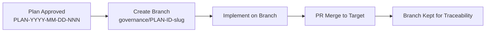
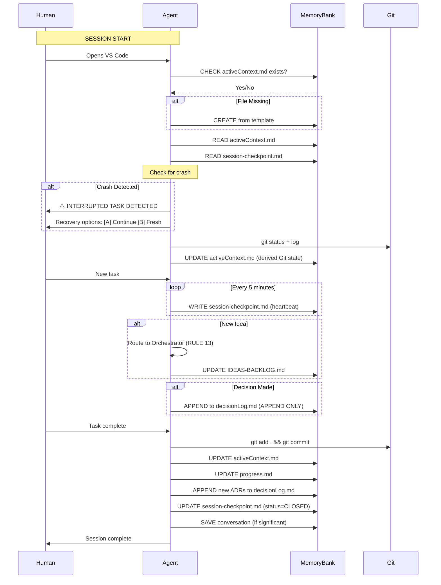

# PLAN: Integrated Ideation-to-Release — v2.5
## With Memory Bank Enhancement (mychen76 Principles) + Expert Review Insights

**Artifact ID:** PLAN-2026-04-01-001
**Document ID:** PLAN-integrated-ideation-to-release-v2
**Version:** 2.5
**Status:** Draft — For Human Review
**Created:** 2026-04-01T09:00:00Z
**Modified:** 2026-04-01T16:21:00Z
**Session ID:** s2026-04-01-architect-0001
**Author:** Architect mode
**Branch:** develop
**Target Branch:** governance/PLAN-2026-04-01-001-ideation-release-v2

---

---

## Part 0: Artifact Identification Schema (YYYY-MM-DD + Sequential)

All artifacts, items, decisions, ideas, and file names MUST follow this identification schema for traceability and temporal ordering.

### 0.1 Core Principle: Every Artifact Has Identity

> **"If it's not dated and numbered, it doesn't exist in the traceable universe."**

Every artifact in the system carries:
1. **Created timestamp** — when it was born
2. **Modified timestamp** — when it last changed
3. **Sequential ID** — for cross-referencing
4. **Session origin** — which session created it

### 0.2 Artifact ID Format Reference

| Artifact Type | ID Format | Example | Notes |
|--------------|-----------|---------|-------|
| **Business Idea** | `IDEA-{YYYY-MM-DD}-{NNN}` | `IDEA-2026-04-01-001` | 3-digit seq per day |
| **Technical Suggestion** | `TECH-{YYYY-MM-DD}-{NNN}` | `TECH-2026-04-01-001` | Tech suggestions backlog |
| **Architecture Decision** | `ADR-{YYYY-MM-DD}-{NNN}` | `ADR-2026-04-01-001` | Append-only decision log |
| **Session** | `s{YYYY-MM-DD}-{mode}-{NNN}` | `s2026-04-01-architect-001` | Mode-specific counter |
| **Refinement Session** | `REF-{YYYY-MM-DD}-{NNN}` | `REF-2026-04-01-001` | Intake refinement logs |
| **Conversation** | `{YYYY-MM-DD}-{source}-{slug}` | `2026-04-01-gemini-workbench` | Saved convos |
| **Batch Job** | `BATCH-{YYYY-MM-DD}-{NNNN}` | `BATCH-2026-04-01-0001` | API batch submissions |
| **Expert Report** | `RPT-{YYYY-MM-DD}-{NNNN}` | `RPT-2026-04-01-0001` | Expert analysis outputs |
| **Commit** | `{type}({scope}): {subject}` | `feat(ideas): add IDEA-001` | Conventional Commits |
| **Branch** | `{type}/{IDEA-NNN}-{slug}` | `feature/IDEA-001-hot-cold` | Feature branch naming |
| **Git Tag** | `v{MAJOR}.{MINOR}.{PATCH}` | `v2.1.0` | Release tags |
| **Phase** | `PHASE-{N}-{name}` | `PHASE-1-ideation` | Orchestration phases |
| **Epic** | `EPIC-{NNNN}` | `EPIC-0001` | Large feature groupings |
| **User Story** | `US-{YYYY-MM-DD}-{NNN}` | `US-2026-04-01-001` | User story cards |

### 0.3 File Naming Convention

| File Type | Naming Pattern | Example |
|-----------|----------------|---------|
| **Canonical Doc** | `DOC-{N}-v{MAJOR}.{MINOR}-{Name}.md` | `DOC-2-v2.1-Architecture.md` |
| **Idea Detail** | `IDEA-{NNNN}-{slug}.md` | `IDEA-001-hot-cold-memory.md` |
| **ADR Detail** | `ADR-{NNNN}-{slug}.md` | `ADR-010-dev-tooling.md` |
| **Refinement Log** | `REFINEMENT-{YYYY-MM-DD}-{id}.md` | `REFINEMENT-2026-04-01-001.md` |
| **Conversation** | `{YYYY-MM-DD}-{source}-{slug}.md` | `2026-03-28-gemini-workbench.md` |
| **Batch Results** | `{BATCH-ID}-{type}-REPORT.md` | `BATCH-2026-04-01-0001-GOVERNANCE-REPORT.md` |
| **Plan** | `PLAN-{slug}.md` | `PLAN-integrated-ideation-to-release.md` |
| **Execution Tracker** | `EXECUTION-TRACKER-v{MAJOR}.{MINOR}.md` | `EXECUTION-TRACKER-v2.1.md` |
| **Session Checkpoint** | `session-checkpoint.md` | (Fixed name, with metadata) |
| **Release Notes** | `RELEASE-NOTES-v{MAJOR}.{MINOR}.md` | `RELEASE-NOTES-v2.1.md` |

### 0.4 Required Metadata Header

ALL artifacts MUST include this header block:

```markdown
---
artifact_id: {TYPE}-{YYYY-MM-DD}-{NNN}
version: {X.Y}
created: {YYYY-MM-DDTHH:MM:SSZ}
modified: {YYYY-MM-DDTHH:MM:SSZ}
session_id: {sYYYY-MM-DD-mode-NNN}
author: {mode-name} mode
status: {DRAFT|IN_REVIEW|APPROVED|FROZEN}
---
```

### 0.5 Timestamp Granularity Standards

| Context | Format | Example |
|---------|--------|---------|
| **File name** | `YYYY-MM-DD` | `2026-04-01` |
| **Header metadata** | `YYYY-MM-DDTHH:MM:SSZ` | `2026-04-01T09:15:00Z` |
| **Session ID** | `YYYY-MM-DD` | `s2026-04-01-architect-001` |
| **Commit timestamp** | ISO 8601 in commit body | `committed: 2026-04-01T09:15:00Z` |
| **ADR Date** | `YYYY-MM-DD` | `**Date:** 2026-04-01` |
| **Decision log** | `YYYY-MM-DDTHH:MM:SSZ` | `**Timestamp:** 2026-04-01T09:15:00Z` |
| **Git tag** | `v{MAJOR}.{MINOR}.{PATCH}` | `v2.1.0` (no date in tag) |
| **Heartbeat** | ISO 8601 | `last_heartbeat: 2026-04-01T09:15:00Z` |

### 0.6 Daily Sequential Counter Reset

**RULE 0.6**: The 3-digit sequential counter (`{NNN}`) resets at midnight UTC each day.

| Day | Sequence |
|-----|----------|
| 2026-04-01 | IDEA-2026-04-01-001, IDEA-2026-04-01-002, ... |
| 2026-04-02 | IDEA-2026-04-02-001, IDEA-2026-04-02-002, ... |

This ensures:
- Cross-referencing by date is instant
- No collision if multiple agents work in parallel
- Audit trail is temporally sortable

### 0.7 Cross-Reference Linking Standard

When referencing artifacts within other artifacts:

```markdown
<!-- Cross-reference format -->
• Related: [IDEA-2026-04-01-001](./docs/ideas/IDEA-2026-04-01-001-hot-cold-memory.md)
• Blocks: [ADR-2026-04-01-003](./docs/ideas/ADR-2026-04-01-003-cascade-delete.md)
• Part of: [EPIC-0001](./docs/ideas/EPIC-0001-memory-bank-v2.md)

<!-- In commit messages -->
Refs: IDEA-2026-04-01-001 | ADR-2026-04-01-003 | Session: s2026-04-01-architect-001
```

### 0.8 Session ID Propagation

Every session carries its ID through all artifacts it creates:

```
s{YYYY-MM-DD}-{mode}-{NNN}
   └───────┬───────┘ └───┬──┘
       Date          Mode+Seq

Examples:
s2026-04-01-architect-001  (first architect session on Apr 1)
s2026-04-01-developer-001   (first developer session on Apr 1)
s2026-04-02-scrum-master-001 (first scrum-master session on Apr 2)
```

### 0.9 Commit Message with Full Traceability

```bash
# Full format with timestamps and IDs
git commit -m "feat(ideas): implement hot-cold memory separation

• Changed: memory-bank/ structure, .clinerules
• Related: IDEA-2026-04-01-001, ADR-2026-04-01-002
• Session: s2026-04-01-architect-001
• Timestamp: 2026-04-01T09:30:00Z

Refs: IDEA-2026-04-01-001 | Session: s2026-04-01-architect-001"
```

### 0.10 Migration: Existing Artifacts

Existing artifacts without proper IDs should be migrated:

| Old Format | New Format | Action |
|------------|------------|--------|
| `IDEA-001` | `IDEA-2026-03-15-001` | Assign creation date (assume mid-march) |
| `ADR-006` | `ADR-2026-03-15-006` | Assign from decisionLog.md date |
| `PLAN-name.md` | `PLAN-{YYYY-MM-DD}-{name}.md` | Add date prefix |

---

## Part 0.1: Plan-to-Branch Lifecycle (MANDATORY)

### Core Principle: One Plan = One Branch = One Scope

> **Every plan creates a branch. Every branch implements a plan. No exceptions.**

From RULE 10 (GitFlow Enforcement), each plan execution MUST follow this lifecycle:



### Branch Naming Convention for Plans

| Plan Type | Branch Pattern | Example |
|-----------|----------------|---------|
| Governance Enhancement | `governance/{PLAN-ID}-{slug}` | `governance/PLAN-2026-04-01-001-ideation-release` |
| Feature Implementation | `feature/{IDEA-ID}-{slug}` | `feature/IDEA-2026-04-01-001-hot-cold` |
| Bug Fix | `fix/{issue-id}-{slug}` | `fix/ADR-2026-04-01-003-session-crash` |
| Documentation | `docs/{DOC-ID}-{slug}` | `docs/DOC-2-v2.2-architecture` |
| Template/Workbench | `template/{change}-{slug}` | `template/memory-bank-v2` |

### Plan Execution Workflow

```
┌─────────────────────────────────────────────────────────────────┐
│                 PLAN EXECUTION WORKFLOW                           │
│                                                                  │
│  STEP 1: PLAN APPROVAL                                           │
│  Human approves PLAN-YYYY-MM-DD-NNN                              │
│                                                                  │
│  STEP 2: BRANCH CREATION                                         │
│  git checkout -b {type}/{PLAN-ID}-{slug}                         │
│  e.g.: git checkout -b governance/PLAN-2026-04-01-001-ideation  │
│                                                                  │
│  STEP 3: EXECUTE ON BRANCH                                      │
│  Implement all checklist items on this branch                    │
│  Every commit includes: Refs: PLAN-YYYY-MM-DD-NNN               │
│                                                                  │
│  STEP 4: TEST & VALIDATE                                         │
│  Ensure all items checked off, all tests pass                    │
│                                                                  │
│  STEP 5: PR TO TARGET BRANCH                                     │
│  git push -u origin {type}/{PLAN-ID}-{slug}                     │
│  Open PR → review → merge (NO squash, NO delete branch)          │
│                                                                  │
│  STEP 6: BRANCH PRESERVED                                        │
│  Branch kept forever for traceability (RULE 10.3)               │
└─────────────────────────────────────────────────────────────────┘
```

### Dual Project Applicability

This plan applies to **TWO contexts**:

#### Context A: Workbench Project (le workbench)

The `agentic-agile-workbench` project itself:

```
Repository: agentic-agile-workbench
Default Branch: develop
Plan Branch: governance/PLAN-2026-04-01-001-ideation-release-v2
Target: develop
```

| Phase | Action | Repository |
|-------|--------|------------|
| 1 | Create branch | agentic-agile-workbench |
| 1 | Implement changes | agentic-agile-workbench |
| 1 | Test on branch | agentic-agile-workbench |
| 2 | PR to develop | agentic-agile-workbench |

#### Context B: Future Application Projects

When deploying workbench to a new project via [`deploy-workbench-to-project.ps1`](deploy-workbench-to-project.ps1):

```
Repository: {new-project}
Default Branch: develop
Plan Branch: governance/{PLAN-ID}-{slug}
Target: develop
```

| Step | Action | Repository |
|------|--------|------------|
| 1 | Run deploy-workbench.ps1 | {new-project} |
| 2 | Branch for governance | {new-project} |
| 3 | Apply plan changes | {new-project} |
| 4 | PR to develop | {new-project} |

### What Gets Deployed to New Projects

The template folder (`template/`) contains:

| Template Path | Purpose |
|---------------|---------|
| `template/.clinerules` | Rules with PLACEHOLDER comments |
| `template/memory-bank/` | Hot/Cold structure |
| `template/docs/` | DOC-*-CURRENT pointers |
| `template/prompts/` | System prompts |
| `template/.roomodes` | Agile personas |

### NEW RULE: RULE G-0 — Plan-Branch Parity

```markdown
## RULE G-0: PLAN-BRANCH PARITY

1. BEFORE any plan execution: Create branch named `governance/{PLAN-ID}-{slug}`
2. ALL work happens on that branch
3. Commit messages include: `Refs: {PLAN-ID}`
4. PR merges to target (develop or develop-vX.Y)
5. Branch is NEVER deleted after merge (traceability)
6. Plan document is updated with:
   - Branch name
   - PR link
   - Merge date
```

---

## Executive Summary

This document refactors three governance plans into a **coherent, minimal governance system** that:

1. **No idea loss** — every human input is captured, processed, never forgotten
2. **Multi-session continuity** — agents know context across days/weeks
3. **Agent proactivity** — agents remind human about stale ideas, pending reviews, sync opportunities
4. **Full traceability** — every change linked to IDEA/ADR, session, and commit

### The Three Source Documents

| Source Document | What It Addresses |
|----------------|-------------------|
| `PLAN-integrated-ideation-to-release.md` | 3-artifact + Git scheme, commit strategy |
| `PLAN-roo-code-session-model.md` | Session = VS Code window, crash recovery |
| `PLAN-session-protocol.md` | Session lifecycle, checkpoints, continuity |

### Critical Enhancement: Memory Bank (mychen76)

> **"The community realized that LLMs became amnesiac after a few iterations. So they created this 'memory bank' system via Custom Instructions that force the AI to read these Markdown files at the start of each task and update `progress.md` and `decisionLog.md` at the end."**

This v2.0 refactors the plans with **6 Memory Bank enhancements** derived from mychen76 principles.

---

## Part I: The Problem (Enhanced with mychen76)

### Current State: The AI Amnesia Problem

From mychen76's analysis, the fundamental issues are:

| Problem | Root Cause | Impact |
|---------|------------|--------|
| **LLM Amnesia** | LLMs lose context after truncation | Agents forget previous decisions |
| **Lost in the Middle** | Too much info dilutes attention | Important details missed |
| **Context Explosion** | Hot files grow unbounded | Token waste, slower inference |
| **Hallucination** | No persistent anchor for facts | Agents invent false history |
| **Crash Loss** | No checkpoint during work | Work lost on laptop close |

### Current State: Artifact Overload

| Artifact | Problem |
|----------|---------|
| progress.md | Redundant with Git (checkbox = git log) |
| EXECUTION-TRACKER | Redundant with Git (session log = git log) |
| TECH-SUGGESTIONS-BACKLOG | Separate backlog = duplicated tracking |
| activeContext.md | Manually updated = drifts from Git state |
| DOC-3 | Manually maintained = diverges from reality |
| decisionLog.md | ✅ KEEP — ADR format is correct |
| IDEAS-BACKLOG.md | ✅ KEEP — need to track uncommitted ideas |

### Current State: Precious Things Not Versioned

| Not in Git | Risk |
|------------|------|
| `batch_artifacts/` (expert reports, final_backlog.json) | HIGH — $50 of API calls, irreplaceable |
| Most conversations | CRITICAL — institutional memory loss |
| activeContext updates | Only updated when remembered |

### Current State: Commit Quality Issues

| Anti-Pattern | Problem |
|--------------|--------|
| Micro-commits | Noise in git log |
| Mega-commits | Unsearchable history |
| Orphan commits | No IDEA linkage |
| Vague messages | Can't reconstruct intent |

---

## Part II: The Solution — Unified Architecture with Memory Bank

### Core Principle 1: Git as Authoritative History

> **Git is the source of truth for WHAT changed, WHEN, and WHO. Everything else derives from it or tracks what Git cannot (uncommitted ideas, human intent).**

### Core Principle 2: Memory Bank as Anti-Amnesia Shield

> **Memory Bank exists SOLELY to prevent AI amnesia and "Lost in the Middle" — it is not storage, it is a cognitive prosthetic.**

The 5 functions of Memory Bank (from mychen76):
1. **Context Restoration** — Read at session start to restore state
2. **Decision Anchoring** — ADRs prevent hallucinated history
3. **Progress Tracking** — Checkboxes give humans quick status
4. **Continuity Bridge** — Checkpoint survives crashes
5. **Audit Trail** — Git logs + Memory Bank = complete history

---

## Part III: The 5-Artifact Scheme with Enhancement

### The Memory Bank Hot/Cold Architecture (mychen76-Inspired)

```
memory-bank/
├── hot-context/           # Read directly at session start
│   ├── activeContext.md   # Current task, session state
│   ├── progress.md       # Checkbox tracking
│   ├── decisionLog.md     # ADRs (append-only!)
│   ├── systemPatterns.md  # Architecture conventions
│   ├── productContext.md  # Backlog, user stories
│   └── session-checkpoint.md  # CRASH RECOVERY (NEW)
├── projectBrief.md        # Vision (root, rarely changes)
├── techContext.md         # Stack, commands (root)
└── archive-cold/          # MCP ONLY access (RULE 9)
    ├── sprint-logs/
    ├── completed-tickets/
    └── productContext_Master.md
```

### The 5-Artifact Scheme

| Artifact | Purpose | Single Source? | Memory Bank Role |
|----------|---------|----------------|------------------|
| **IDEAS-BACKLOG.md** | WHAT WE WANT (unified backlog) | ✅ | Outside Memory Bank (governance) |
| **activeContext.md** | WHERE WE ARE (session context) | ✅ | **hot-context/** — read at start |
| **decisionLog.md** | WHY WE DECIDED (ADR format) | ✅ | **hot-context/** — APPEND ONLY |
| **session-checkpoint.md** | CRASH RECOVERY | ✅ | **hot-context/** — written every 5 min |
| **Git** | Authoritative history | ✅ | External — all artifacts versioned |

### Memory Bank Enhancement #1: APPEND ONLY for ADRs

From mychen76: `"append_memory_bank_entry allows adding a decision or updating the status in a structured and timestamped way without risking overwriting the whole file"`

**NEW RULE**: `decisionLog.md` is **APPEND ONLY** — never overwrite, only append new ADRs.

```markdown
<!-- CORRECT: Append new ADR -->
## ADR-015: New Decision
**Date:** 2026-04-01
...

<!-- WRONG: Overwriting existing ADRs -->
# Decision Log — please replace this entire file
```

### Memory Bank Enhancement #2: Session Checkpoint in Memory Bank

The `session-checkpoint.md` lives in `hot-context/` because:
1. It's read at session start for crash recovery
2. It follows the same access pattern as other hot files
3. It's versioned in Git like other Memory Bank files

```markdown
<!-- memory-bank/hot-context/session-checkpoint.md -->
---
session_id: s2026-04-01-architect-0001
status: ACTIVE
created_at: 2026-04-01T09:00:00Z
last_heartbeat: 2026-04-01T09:15:00Z
---

## Task History
- task_id: 1, started: 09:00, completed: 09:30, outcome: COMPLETED
- task_id: 2, started: 09:35, checkpoint: 09:40, status: INTERRUPTED

## Git State at Last Checkpoint
- branch: develop
- staged_files: [list]
- last_commit: abc1234
```

### Memory Bank Enhancement #3: File Size Rotation

**NEW RULE**: When hot-context files exceed size limits, archive oldest content to cold:

| File | Size Limit | Action When Exceeded |
|------|------------|---------------------|
| decisionLog.md | 500 lines | Archive oldest 50% to cold |
| productContext.md | 1000 lines | Archive completed sprints to cold |
| progress.md | 200 lines | Archive old releases to cold |

---

## Part IV: Git Commit Strategy (Unchanged from v1)

### Commit Message Template

```
<type>(<scope>): <subject>

<body>

• Changed: <files/features>
• Related: <linked IDEA/ADR>

Refs: IDEA-NNN | Session: sYYYY-MM-DD-mode-NNN
```

### Type Vocabulary

| Type | When |
|------|------|
| `feat` | New feature (IDEAS-BACKLOG item) |
| `fix` | Bug fix |
| `docs` | Documentation only |
| `refactor` | Code restructure |
| `test` | Tests |
| `chore` | Tooling, config |
| `governance` | Process/workflow |
| `session` | Session metadata |

---

## Part V: Session Protocol with Memory Bank Integration

### Session Start Protocol (Enhanced)

```
┌─────────────────────────────────────────────────────────────────┐
│                     SESSION START SEQUENCE                       │
│                                                                  │
│  STEP 1: MEMORY BANK READ (RULE 1 — NON-NEGOTIABLE)           │
│  ─────────────────────────────────────────────────────────────── │
│  1. CHECK: Does memory-bank/hot-context/activeContext.md exist?│
│  2. CREATE: If not, create from template                        │
│  3. READ:                                                       │
│     a. memory-bank/hot-context/activeContext.md                 │
│     b. memory-bank/hot-context/progress.md                      │
│     c. memory-bank/hot-context/session-checkpoint.md            │
│                                                                  │
│  STEP 2: CRASH DETECTION                                        │
│  ───────────────────────────                                    │
│  IF session-checkpoint.md.last_heartbeat > 30 minutes:          │
│     → Detect as CRASH/PAUSED                                    │
│     → Report uncommitted work                                   │
│     → Offer recovery options                                    │
│                                                                  │
│  STEP 3: GIT DERIVED CONTEXT                                    │
│  ───────────────────────────────                                │
│  1. Git status + log                                            │
│  2. Derive: branch, last commit, active branches               │
│  3. Update activeContext.md with derived Git state               │
│                                                                  │
│  STEP 4: REPORT TO HUMAN                                        │
│  ────────────────────────────                                   │
│  "Session: s2026-04-01-architect-0001"                         │
│  "Last commit: abc1234 (2 hours ago)"                          │
│  "Stale ideas: IDEA-015 (8 days in REFINING)"                  │
│  "Recent decisions: ADR-014"                                   │
└─────────────────────────────────────────────────────────────────┘
```

### Memory Bank Enhancement #4: Checkpoint Heartbeat

From mychen76: The session checkpoint is written every 5 minutes to survive crashes.

```python
# During task execution, every 5 minutes:
checkpoint.last_heartbeat = now()
checkpoint.git_state = get_git_status()
write_checkpoint(checkpoint)  # → memory-bank/hot-context/session-checkpoint.md
```

### During Session

```
- New idea → intake → IDEAS-BACKLOG.md (timestamp + session_id)
- Decision → APPEND to decisionLog.md (NEVER overwrite)
- Blocker → activeContext.md blockers[]
- Every 5 min → Update session-checkpoint.md heartbeat
- Complete unit → commit with session_id + IDEA linkage
```

### Session End Protocol

```
┌─────────────────────────────────────────────────────────────────┐
│                   SESSION END SEQUENCE                           │
│                                                                  │
│  STEP 1: FINAL HEARTBEAT                                        │
│  checkpoint.last_heartbeat = now()                               │
│  checkpoint.status = CLOSING                                     │
│                                                                  │
│  STEP 2: CHECK FOR UNCOMMITTED WORK                              │
│  git_status = git status                                        │
│  IF git_status.has_uncommitted:                                 │
│     → Offer to commit before closing                            │
│                                                                  │
│  STEP 3: UPDATE MEMORY BANK (RULE 2 — NON-NEGOTIABLE)          │
│  ─────────────────────────────────────────────────────────────  │
│  1. activeContext.md: session_id, work_done[], blockers[]        │
│  2. progress.md: check off completed items                       │
│  3. decisionLog.md: APPEND new ADRs (never overwrite)           │
│                                                                  │
│  STEP 4: UPDATE SESSION CHECKPOINT                              │
│  checkpoint.status = CLOSED                                     │
│  checkpoint.closed_at = now()                                    │
│                                                                  │
│  STEP 5: SAVE CONVERSATION (if significant)                     │
│  → docs/conversations/sYYYY-MM-DD-{mode}-{N}.md                 │
│                                                                  │
│  STEP 6: GIT COMMIT                                             │
│  git add . && git commit -m "docs(memory): session end"         │
└─────────────────────────────────────────────────────────────────┘
```

---

## Part VI: MCP Architecture (Future Enhancement)

### Memory Bank Enhancement #5: MCP Server Integration

From mychen76: The industry standard is `mcp-server-memory` with 4 strict tools:

| Tool | Purpose |
|------|---------|
| `initialize_memory_bank` | Creates folder structure from templates |
| `check_memory_bank_status` | Shows which files are available |
| `read_memory_bank_file` | Reads specific Memory Bank file |
| `append_memory_bank_entry` | **Appends** to file without overwrite |

**Current Gap**: We're doing direct file I/O. Future enhancement:

```python
# Instead of:
with open('decisionLog.md', 'w') as f:
    f.write(new_content)  # RISK: overwrites existing

# Use MCP:
append_memory_bank_entry('decisionLog.md', new_adr_entry)  # SAFE: only append
```

### Memory Bank Enhancement #6: Semantic Cold Archive

From mychen76: "You MUST use your `query_semantic_memory` MCP tool for cold archive."

**Current State**: RULE 9 (Cold Zone Firewall) exists but:
- No MCP tool implementation
- No semantic search capability

**Future Enhancement**:
```
When agent needs historical info:
1. Use query_semantic_memory("Why did we choose Redis?")
2. MCP searches cold archive via ChromaDB
3. Returns only relevant paragraphs
4. Agent incorporates into context
```

---

## Part VII: Proactivity Mechanisms

### Session Start: Mandatory Reminders (RULE 4 — Unchanged)

At EVERY session start, agent MUST check and report:

| Check | Threshold | Action |
|-------|-----------|--------|
| Stale ideas | [REFINING] > 7 days | "IDEA-015 has been refining for 8 days" |
| Pending tech reviews | [TECH IDEA] > 3 days | "TECH-001 needs architecture evaluation" |
| Sync opportunities | On new idea intake | "IDEA-016 may overlap with IDEA-012" |
| Context staleness | activeContext > 24h old | "Context is stale, refreshing..." |

### Intake: Proactive Linking

When a new idea is captured:

1. **Acknowledge** — "I've captured IDEA-016: PDF export"
2. **Scan for overlaps** — check IDEAS-BACKLOG
3. **Link related** — "This overlaps with TECH-001 (Redis caching)"
4. **Suggest coordination** — "Would you like to refine them together?"

---

## Part VIII: Rules Summary (NEW with Memory Bank)

### New Rules for .clinerules

```markdown
## RULE MB-1: MEMORY BANK AS COGNITIVE PROSTHETIC

Memory Bank exists to prevent AI amnesia and "Lost in the Middle":
1. READ at session start — always restore context from files
2. WRITE at session end — always persist state to files
3. APPEND for ADRs — never overwrite decisionLog.md
4. HEARTBEAT every 5 min — update session-checkpoint.md

## RULE MB-2: SESSION CHECKPOINT (Crash Recovery)

Every 5 minutes during active work:
1. Update session-checkpoint.md.last_heartbeat
2. Update session-checkpoint.md.git_state
3. Update session-checkpoint.md.current_task

At session start:
IF session-checkpoint.last_heartbeat > 30 minutes:
   → Report crash detection
   → Offer recovery options

## RULE MB-3: APPEND ONLY FOR ADRs

decisionLog.md is APPEND ONLY:
- NEVER overwrite existing ADRs
- NEVER delete entries
- Archive old entries to cold only when file > 500 lines

## RULE MB-4: FILE SIZE ROTATION

When hot-context files exceed limits, archive oldest content:
| File | Limit | Archive |
|------|-------|---------|
| decisionLog.md | 500 lines | Oldest 50% → cold |
| productContext.md | 1000 lines | Completed sprints → cold |
| progress.md | 200 lines | Old releases → cold |

## RULE C-1: THREE ARTIFACTS (Enhanced)

Keep only:
1. IDEAS-BACKLOG.md — unified backlog (biz + tech)
2. memory-bank/hot-context/activeContext.md — session context
3. memory-bank/hot-context/decisionLog.md — ADR format (APPEND ONLY)

Drop:
- progress.md (derived from Git — KEEP but simplify)
- EXECUTION-TRACKER (derived from Git)
- TECH-SUGGESTIONS-BACKLOG (merged into IDEAS-BACKLOG)

## RULE C-2: GIT AS AUTHORITATIVE HISTORY

Git tracks: WHAT changed, WHEN, WHO, WHY (via commit messages)
Everything else derives from Git or tracks what Git cannot (uncommitted ideas).

## RULE C-3: SESSION ID PROPAGATION

Every session has unique ID: sYYYY-MM-DD-{mode}-{NNNN}
At session start: load session-checkpoint.md
At session end: update session-checkpoint.md (status=CLOSED)
In commit: include Session: field

## RULE G-1: COMMIT MESSAGE TEMPLATE

Every commit follows:
<type>(<scope>): <subject>

<body>

Refs: IDEA-NNN | Session: sYYYY-MM-DD-mode-NNN

## RULE G-2: COMMIT GRANULARITY

Commit AFTER each complete, testable, logically isolated unit.
Don't commit if build broken, mid-feature, or trivial.

## RULE P-1: PRECIOUS THINGS RULE

Version anything that cost MONEY or TIME:
- batch_artifacts/ outputs → docs/batch-outputs/
- Significant conversations → docs/conversations/

## RULE P-2: CONVERSATION CAPTURE

At session end:
- If significant work: save to docs/conversations/
- Add entry to docs/conversations/README.md
- Link from related IDEA/ADR
```

---

## Part IX: Comparison

### Before vs After

| Aspect | Before | After (v2.0) |
|--------|--------|--------------|
| Memory Bank Purpose | "Storage" | **Anti-Amnesia Shield** |
| ADRs | Overwritten | **APPEND ONLY** |
| Session Checkpoint | Separate file | **In hot-context/** |
| Checkpoint Heartbeat | Not defined | **Every 5 minutes** |
| File Size | Unbounded | **Rotation policy** |
| Cold Archive | "Don't read" | **Semantic query (future)** |
| MCP Integration | None | **4 tools (future)** |
| Tracking artifacts | 7+ files | 3 files |
| Manual updates | ~740 lines/session | ~250 lines/session |

---

## Part X: Implementation Phases

### Phase 1: Consolidate + Memory Bank (1 session)

- [ ] Add session-checkpoint.md to hot-context/
- [ ] Implement APPEND ONLY for decisionLog.md
- [ ] Add FILE SIZE ROTATION rule
- [ ] Archive TECH-SUGGESTIONS into IDEAS-BACKLOG

### Phase 2: Session Checkpoint Protocol (1 session)

- [ ] Implement heartbeat every 5 minutes
- [ ] Implement crash detection at session start
- [ ] Test crash recovery

### Phase 3: MCP Integration (Future - v3.0)

- [ ] Implement mcp-server-memory tools
- [ ] Implement semantic cold archive query
- [ ] Implement append_memory_bank_entry

### Phase 4: Test & Iterate (ongoing)

- [ ] Use new process for 1 week
- [ ] Identify friction points
- [ ] Adjust rules as needed


---

## Part XIII: Deferred Enhancement Tracking (MANDATORY)

### Why We Need This Section

> **"Future enhancements mentioned in passing are forgotten enhancements."**

Every "future" item MUST be formally tracked, not just mentioned. This prevents:
- Good ideas getting lost in old documents
- Duplicate research when we "rediscover" the same enhancement
- No accountability for implementing valuable improvements

### Enhancement ID Format

```
ENH-{YYYY-MM-DD}-{NNN}
```

Example: `ENH-2026-04-01-001` (MCP Memory Server)

### Fields for Each Enhancement

| Field | Description |
|-------|-------------|
| `enhancement_id` | Unique ID (ENH-YYYY-MM-DD-NNN) |
| `title` | Short title |
| `source_plan` | Which plan mentioned this |
| `mentioned_date` | When first documented |
| `status` | DEFERRED / IN_PROGRESS / COMPLETED |
| `priority` | P0 / P1 / P2 / P3 |
| `rationale` | Why it's valuable |
| `blocking_factors` | What must be true before implementation |
| `owner` | Who is responsible |
| `target_version` | Which release should include it |
| `related` | Linked IDEA/TECH items |

### Currently Deferred Enhancements

#### ENH-2026-04-01-001: MCP Memory Server Integration

| Field | Value |
|-------|-------|
| `enhancement_id` | ENH-2026-04-01-001 |
| `title` | MCP Memory Server Integration |
| `source_plan` | PLAN-2026-04-01-001 (Part VI) |
| `mentioned_date` | 2026-04-01 |
| `status` | DEFERRED |
| `priority` | P1 |
| `rationale` | Industry standard for Memory Bank - enables semantic cold archive queries, safe append operations |
| `blocking_factors` | Phase 1-2 must be stable first; Calypso FastMCP server must be operational |
| `owner` | Unassigned |
| `target_version` | v3.0 |
| `related` | TECH-2026-04-01-001 (from TECH-SUGGESTIONS-BACKLOG) |

**Specific Items**:
- [ ] Implement `mcp-server-memory` tools
- [ ] Implement semantic cold archive query (`query_semantic_memory`)
- [ ] Implement `append_memory_bank_entry`
- [ ] Integrate with Calypso FastMCP

#### ENH-2026-04-01-002: Semantic Cold Archive Query

| Field | Value |
|-------|-------|
| `enhancement_id` | ENH-2026-04-01-002 |
| `title` | Semantic Cold Archive Query via MCP |
| `source_plan` | PLAN-2026-04-01-001 (Part VI, MB-5) |
| `mentioned_date` | 2026-04-01 |
| `status` | DEFERRED |
| `priority` | P1 |
| `rationale` | RULE 9 (Cold Zone Firewall) requires MCP tool - direct read of cold archive is forbidden |
| `blocking_factors` | ENH-2026-04-01-001 must be implemented first |
| `owner` | Unassigned |
| `target_version` | v3.0 |
| `related` | ENH-2026-04-01-001 |

### NEW RULE: RULE D-1 — Deferred Enhancement Tracking

```markdown
## RULE D-1: DEFERRED ENHANCEMENT TRACKING

1. When a plan mentions "Future Enhancement":
   → Create ENH-YYYY-MM-DD-NNN entry in this section
   → Do NOT rely on the plan document itself as the tracker

2. Track in two places:
   → This plan's "Deferred Enhancement Tracking" section
   → TECH-SUGGESTIONS-BACKLOG.md with type="ENHANCEMENT"

3. Review at each release planning:
   → Check status of all ENH-*
   → Move DEFERRED → IN_PROGRESS if blocking factors resolved
   → Archive COMPLETED enhancements

4. Do NOT let "future" mean "forgotten":
   → Every enhancement has a target_version
   → Every enhancement has an owner
   → Every enhancement has blocking_factors clearly stated
```

### Enhancement Review Checklist (At Release Planning)

```
□ List all ENH-* items with status DEFERRED
□ Check if blocking_factors have been resolved
□ Reassess priority based on current needs
□ Assign/rotate owners
□ Update target_version or move to IN_PROGRESS
□ Document rationale for any enhancement that remains DEFERRED after 2 releases
```

---

## Part XI: mychen76 Memory Bank Principles Summary
From the conversation with mychen76, these are the **5 core Memory Bank principles** that this v2.0 plan implements:

### Principle 1: Context Restoration at Session Start
> "At the beginning of each new session (even 3 weeks later), the Lead PM Agent has the obligation to read these files before speaking."

**Implementation**: RULE 1 (CHECK→CREATE→READ→ACT)

### Principle 2: Decision Anchoring (ADR)
> "If you made a localized technical choice... log it briefly in `memory-bank/decisionLog.md`."

**Implementation**: decisionLog.md with APPEND ONLY discipline

### Principle 3: Append-Only for Safety
> "append_memory_bank_entry allows adding a decision or updating the status in a structured and timestamped way without risking overwriting the whole file."

**Implementation**: RULE MB-3 (APPEND ONLY FOR ADRs)

### Principle 4: Hot/Cold Separation
> "The 'Hot' perimeter: The agent only permanently loads the files strictly necessary for its immediate task... The 'Cold' perimeter: As soon as a 'Hot' file becomes too large... old elements are archived."

**Implementation**: RULE MB-4 (FILE SIZE ROTATION) + RULE 9 (COLD ZONE FIREWALL)

### Principle 5: Semantic Query for Cold
> "If your current task requires understanding an architectural decision made months ago... you MUST NOT try to read the archive files. Instead, you must use your `query_semantic_memory` MCP tool."

**Implementation**: FUTURE - MCP semantic query for cold archive

---

## Part XII: Files Summary

### Files to CREATE

| File | Purpose |
|------|---------|
| `memory-bank/hot-context/session-checkpoint.md` | Crash recovery checkpoint |
| `scripts/checkpoint_heartbeat.py` | Write checkpoint every 5 min |

### Files to MODIFY

| File | Change |
|------|--------|
| `.clinerules` | Add RULE MB-1 through MB-4, update RULE 2 |
| `IDEAS-BACKLOG.md` | Add type column, merge TECH-SUGGESTIONS |
| `activeContext.md` | Add session_id, checkpoint reference |
| `decisionLog.md` | Add APPEND ONLY header note |

### Files to ARCHIVE (Keep for Reference)

| File | Action |
|------|--------|
| `progress.md` | Simplify (derived from Git) |
| `EXECUTION-TRACKER-v*.md` | Archive (Git log is source) |
| `TECH-SUGGESTIONS-BACKLOG.md` | Archive (merged into IDEAS-BACKLOG) |

---

## Part XIV: Open Questions

1. **Checkpoint frequency**: 5 minutes OK, or shorter? (3 min for risky work?)
2. **What to include in checkpoint**: Just file list? Also agent reasoning?
3. **Chat history**: Should we try to save Roo Code chat history? (May not be accessible)
4. **MCP timeline**: When to implement MCP integration (v3.0 scope?)

---

## Appendix A: Mermaid — Session Flow with Memory Bank



---

**Next step:** Human reviews and approves PLAN-2026-04-01-001. If approved → Phase 1 implementation via s2026-04-01-architect-002.

---

## Appendix B: Expert Review Insights (from DOC6-REVIEW-RESULTS2.md)

### Critical P0 Contradictions Identified by Expert Review

> **Scope Clarification**: These P0s were identified in DOC6 (Calypso orchestrator). This PLAN-2026-04-01-001 addresses **governance** (how we work). The P0s below marked "OUTSIDE SCOPE" require separate plans for the Calypso project itself.

| P0 ID | Title | Scope | Resolution Status |
|-------|-------|-------|-------------------|
| P0-1 | systemPatterns.md Genesis | OUTSIDE this plan | Requires separate plan for Calypso |
| P0-2 | PRD Artifact Identity Crisis | OUTSIDE this plan | Requires separate plan for Calypso |
| P0-3 | Cold Firewall vs Network Dependency | **Addressed by this plan** | Part VI: Option A + graceful degradation |
| P0-4 | Batch vs Sync API for Phase 3 | **Design clarification** | Not a problem - reasonable choice |

#### P0-1: systemPatterns.md Genesis — OUTSIDE THIS PLAN

> **Reason**: This relates to DOC6 implementation (Calypso orchestrator), not governance.

| Finding | Evidence |
|---------|----------|
| `orchestrator_phase3.py` calls `load_file("./memory-bank/systemPatterns.md")` as **pre-existing input** | Script reads it before it could be populated |
| Neither DOC6 document specifies **when and how** this file is first created for a new project | Gap persists |

**Resolution Required**: Define `systemPatterns.md` as a **two-lifecycle file**:
1. Blank-but-structured template initialized at project creation (from template folder)
2. Progressively populated by Phase 2 Architecture Agent output (via `apply_triage.py`)

**NEW RULE**: `initialize_project.py` or `memory:init` must create `systemPatterns.md` from template before Phase 2 runs.

#### P0-2: PRD Artifact Identity Crisis — OUTSIDE THIS PLAN

> **Reason**: This relates to DOC6 implementation (Calypso orchestrator), not governance.

| Finding | Evidence |
|---------|----------|
| `orchestrator_phase3.py` calls `load_file("./memory-bank/systemPatterns.md")` as **pre-existing input** | Script reads it before it could be populated |
| Neither DOC6 document specifies **when and how** this file is first created for a new project | Gap persists |

**Resolution Required**: Define `systemPatterns.md` as a **two-lifecycle file**:
1. Blank-but-structured template initialized at project creation (from template folder)
2. Progressively populated by Phase 2 Architecture Agent output (via `apply_triage.py`)

**NEW RULE**: `initialize_project.py` or `memory:init` must create `systemPatterns.md` from template before Phase 2 runs.

#### P0-2: PRD Artifact Identity Crisis — UNRESOLVED

| What | Definition |
|------|----------|
| `draft_prd.md` | Working PRD built incrementally during Phase 1 ideation |
| `projectBrief.md` | High-level constitution (Elevator Pitch, KPIs) |
| "PRD payload" | Frozen artifact submitted to Asynchronous Factory — **ambiguous!** |

**Resolution**: `orchestrator_phase2.py` reads `./ideation_board/draft_prd.md` — this is the **authoritative input**.

**NEW RULE**: Phase 1 output is `draft_prd.md`. `projectBrief.md` is a **separate summary artifact**. Never conflate them.

#### P0-3: Cold Zone Firewall vs. Network Dependency — CONTRADICTION

| Finding | Contradiction |
|---------|--------------|
| RULE 9 (Cold Zone Firewall) | Agent must use `query_semantic_memory` MCP for cold archive |
| But: Semantic MCP server is on **Calypso** (Tier 2) | Phase 6 (local Tier 1) requires live network to Calypso |
| This contradicts: | Goal of isolated local execution |

**Resolution Options**:

| Option | Pros | Cons |
|--------|------|------|
| **A**: Accept dependency (Calypso must be online) | Simpler architecture | Breaks if Calypso offline |
| **B**: Cache cold queries locally | Works offline | Complexity + staleness risk |
| **C**: Queue cold queries for when Calypso returns | Reliable | Delayed context |

**Recommendation**: Option A with **graceful degradation** — if Calypso unreachable, agent proceeds with hot-context only and logs "cold query deferred."

#### P0-4: Batch API vs. Synchronous API for Phase 3 — DESIGN CHOICE

| Document | Says |
|----------|------|
| DOC6 A | "Phase 3: Cloud (Batch API). Asynchronous Process." |
| `orchestrator_phase3.py` | Uses `client.messages.create()` — synchronous API |

**Resolution**: The synchronous API is used for "complex reasoning" — this is a **reasonable design choice**. Phase 3 should be renamed: "Complex synthesis (synchronous)" vs "Expert review (batch async)."

### Expert-Recommended Migration Priority

| Phase | Name | Priority | Why |
|-------|------|----------|-----|
| A | Memory Bank Hot/Cold | P0 | Foundation — everything depends on it |
| B | Template enrichment | P0 | `systemPatterns.md` template, ADR format |
| C | Context management clause | P0 | `.clinerules` Cold Zone Firewall |
| D | Calypso FastMCP | P1 | Only valuable once local execution stable |
| E | Phase 2-4 scripts | P1 | Only after Phase 6 (local) is reliable |

**Key Insight from Expert**: "Calypso is the **last thing to build**, not the first. Building Calypso first would be building a factory with no quality-controlled assembly line at the other end."

---

## Appendix C: Changes from v1.0

| Section | v1.0 | v2.0 | Reason |
|---------|------|------|--------|
| Memory Bank Purpose | "Storage" | "Anti-Amnesia Shield" | mychen76 Principle 1 |
| ADRs | Overwrite OK | APPEND ONLY | mychen76 Principle 3 |
| Checkpoint Location | Separate file | In hot-context/ | Follows Memory Bank pattern |
| Heartbeat | Not defined | Every 5 min | Crash recovery |
| File Size | Unbounded | Rotation policy | mychen76 Principle 4 |
| Cold Archive | "Don't read" | Semantic query (future) | mychen76 Principle 5 |

---

---

---

## Appendix G: Changes from v2.4 to v2.5

**Date:** 2026-04-01T16:21:00Z
**Artifact ID:** PLAN-2026-04-01-001
**Session:** s2026-04-01-architect-0001

| Change | Description | Reason |
|--------|-------------|--------|
| **Scope Clarification** | Added P0 resolution status table to Appendix B | Distinguish between governance scope vs Calypso scope |
| **P0-1/P0-2 labeled OUTSIDE** | Marked as requiring separate Calypso plans | These are DOC6 implementation issues |
| **P0-3 labeled ADDRESSED** | Cold Firewall vs Network Dependency → Part VI Option A | This plan covers governance implications |
| **P0-4 labeled DESIGN CHOICE** | Batch vs Sync API is not a problem | Clarification only |
| **Part XIII renumbered** | "Open Questions" → Part XIV | Was duplicate Part XIII |
| **Version Bump** | v2.4 → v2.5 | Minor version for clarification |

---

## Appendix F: Changes from v2.3 to v2.4

**Date:** 2026-04-01T12:15:00Z
**Artifact ID:** PLAN-2026-04-01-001
**Session:** s2026-04-01-architect-0001

| Change | Description | Reason |
|--------|-------------|--------|
| **Part XIII Added** | "Deferred Enhancement Tracking" section | Prevent future enhancements from being forgotten |
| **ENH ID Format** | `ENH-{YYYY-MM-DD}-{NNN}` for tracking | MCP Architecture and other future items |
| **ENH-2026-04-01-001** | MCP Memory Server Integration (DEFERRED, P1, v3.0) | Phase VI of current plan |
| **ENH-2026-04-01-002** | Semantic Cold Archive Query (DEFERRED, P1, v3.0) | RULE 9 enforcement |
| **RULE D-1 Added** | "Deferred Enhancement Tracking" rule | Mandatory tracking process |
| **Enhancement Review Checklist** | At release planning | Ensure nothing stays forgotten |
| **Version Bump** | v2.3 → v2.4 | Minor version for new feature |

---

## Appendix D: Changes from v2.2 to v2.3

**Date:** 2026-04-01T12:07:00Z
**Artifact ID:** PLAN-2026-04-01-001
**Session:** s2026-04-01-architect-0001

| Change | Description | Reason |
|--------|-------------|--------|
| **Part 0.1 Added** | "Plan-to-Branch Lifecycle" section | User requested each plan creates a branch |
| **Branch Naming Convention** | Standardized patterns for governance/features/docs/template | GitFlow RULE 10 alignment |
| **Plan Execution Workflow** | 6-step workflow diagram | Mandatory process for all plans |
| **Dual Project Applicability** | Workbench project + Future projects via deploy script | Universal governance |
| **RULE G-0 Added** | "Plan-Branch Parity" rule | Enforce plan=branch=scope |
| **Target Branch Field** | Added to document header | Track where PR will land |
| **Version Bump** | v2.2 → v2.3 | Minor version for new feature |

---

## Appendix E: Changes from v2.1 to v2.2

**Date:** 2026-04-01T11:55:00Z
**Artifact ID:** PLAN-2026-04-01-001
**Session:** s2026-04-01-architect-0001

| Change | Description | Reason |
|--------|-------------|--------|
| **Part 0 Added** | New "Artifact Identification Schema" section (150+ lines) | User requested comprehensive date/timestamp + numbering |
| **Artifact ID Format** | All artifacts now use `TYPE-YYYY-MM-DD-NNN` format | Traceability and temporal ordering |
| **File Naming Convention** | Standardized naming patterns for all file types | Consistency |
| **Metadata Header** | Required header block for all artifacts | Audit trail |
| **Daily Sequential Counter** | 3-digit counter resets at midnight UTC | Parallel work support |
| **Cross-Reference Standard** | Linking format between artifacts | Traceability |
| **Session ID Propagation** | Formalized `s{date}-{mode}-{seq}` format | Crash recovery |
| **Commit Message Format** | Enhanced with timestamps and full traceability | Git history quality |
| **Version Bump** | v2.1 → v2.2 | Minor version for new feature |
